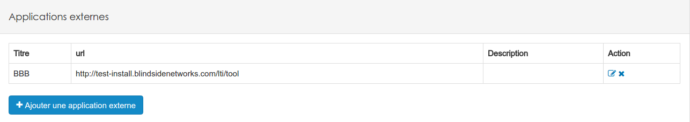
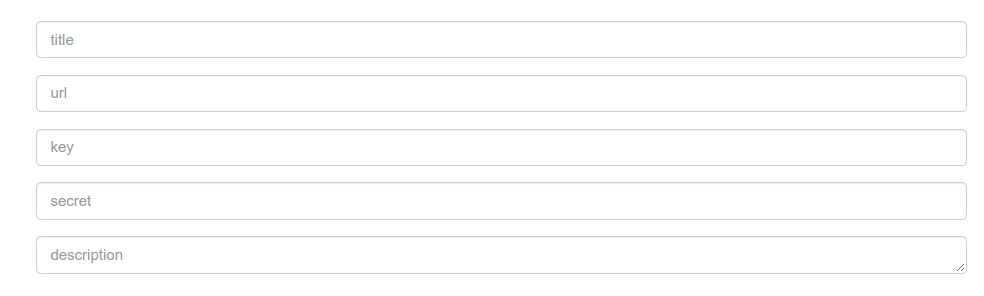
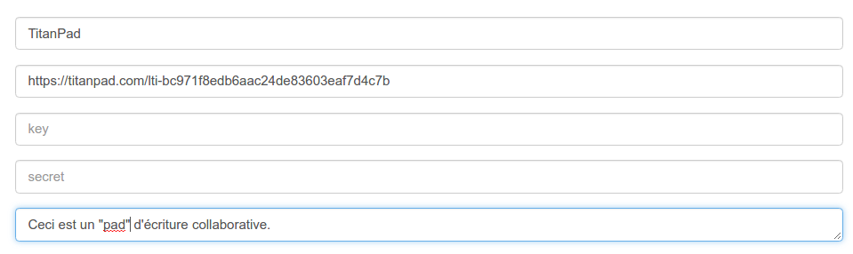
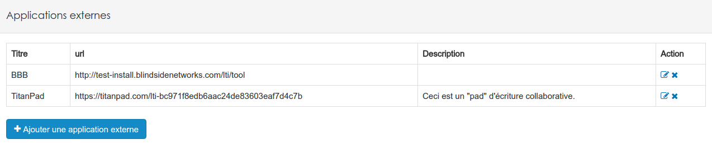

## Learning Tools Interoperability (LTI)

---

LTI est une norme qui permet d'interconnecter des applications avec un LMS pour en étendre ses fonctionnalités. 

Pour créer une nouvelle ressource LTI, il faut se rendre dans le menu "LTI" du menu d'administration de la plateforme.

Vous arrivez alors sur la page suivante:

Ce tableau vous présente la liste de toutes les applications "tierces" que vos utilisateurs peuvent créer dans les ressources. Comme d'habitude, depuis ce tableau, vous pouvez éditer ou supprimer le lien "LTI".

Pour ajouter une nouvelle application externe, il suffit de cliquer sur le bouton homonyme.

Il vous faudra remplir un formulaire. 

* **Title**: Le plus simple est d'utiliser comme titre le nom de l'application externe, ou un nom qui sera compréhensible pour tous vos utilisateurs. Cet en effet ce titre qui identifiera l'application dans le menu à destination des gestionnaire d'espaces d'activités.
* **url**: Il s'agit ici d'encoder l'URL de votre application externe, qu'elle soit sur votre propre serveur ou hébergée ailleurs.
* **key**: Certaines applications nécessitent une clé pour établir le lien. Pour cela je vous invite à consulter la documentation de l'application tierce. Si il n'y en a pas, laissez simplement ce champ vide.
* **secret**: Certaines applications nécessitent un code secret pour établir le lien. Pour cela je vous invite à consulter la documentation de l'application tierce. Si il n'y en a pas, laissez simplement ce champ vide.
* **description**: Ce champ est libre et facultatif, toutes les informations que vous ajoutez à ce niveau seront visible par les utilisateurs.

Une fois le formulaire complété, il suffit de cliquer sur le bouton "ok" en bas à gauche pour terminer la création.

A ce stade-ci, le travail de l'administrateur est terminé. La ressource est disponible pour les utilisateurs depuis les espaces d'activités.

Il faut cliquer sur "Applications externes" pour choisir celle qu'on veut utiliser.

