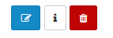

##### Gérer des séances
---
La gestion des séances s'effectuent depuis la page de gestion d'une session. 

Les séances sont séparées en deux familles, les séances ouvertes et les séances terminées.

###### Séances ouvertes

Les séances ouvertes sont les séances dont la date de fin n'est pas encore passée.

Les séances sont présentes sous la forme d'un tableau vous permettant d'avoir accès à la majorité des informations en un coup d'oeil. Depuis ce tableau, de nombreuses actions sont possibles.

* **Le crayon** permet d'éditer la séance, vous aurez alors accès au même formulaire que lors de la [création de la séance](create-sessions-events.md).
* **Le plus** permet de générer une invitation à la séance. La forme de l'invitation dépend [des modèles](models-config.md) que vous aurez créé au préalable.
* **Le chapeau d'étudiant** permet de générer un attestation de présence à la séance. 
* **L'icône "i"** vous permet de consulter, ajouter, éditer ou encore supprimer des commentaires sur la séance.

>Ces commentaires sont visibles par les utilisateurs.

* **La pile de feuilles** permet de répéter la séance.

Vous pouvez choisir les jours de répétition et la date de fin ou ou la durée des répétitions. Une fois votre sélection validée, votre séance sera dupliquée autant de fois que nécessaire.

* **La poubelle** permet comme toujours de supprimer.

Si vous souhaitez ajouter une séance, il faut utiliser le bouton

situé dans le menu supérieur droit. Cela ouvrira un [formulaire de création](create-sessions-events.md).

Une fois que la date de fin d'une séance est passée, la séance est automatiquement transférée dans les sessions terminées.

###### Séances terminées

La présentation est assez semblable à la section précédente.

Néanmoins, vous avez moins d'actions à votre disposition.

Que ce soit pour les séances ouvertes ou les séances terminées, cliquer sur le nom de la séance ouvrira une page dédiée à cette dernière.

En plus des informations et des actions déjà disponibles depuis la page précédente, vous aurez la possibilité d'exporter la liste des inscrits et/ou des formateurs.
Pour cela, il suffit de cliquer sur le bouton représentant 3 silhouettes accolées à une flèche depuis le menu situé en haut à droite. 

C'est également depuis cette page que vous pouvez gérer les [inscriptions aux séances](inscriptions-sessions-events.md). 

