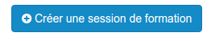
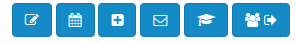
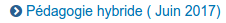
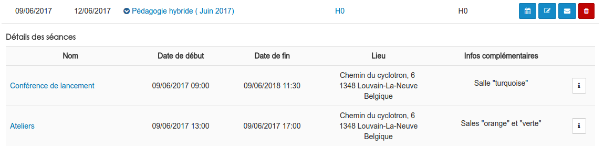

##### Gérer des sessions
---
Dans la pratique, la gestion journalière de  vos formations passera par les sessions. 

Une fois dans le gestionnaire de formation ...

... il vous faudra cliquer sur le deuxième icône du menu supérieur droit pour accéder aux sessions. 

Le menu en haut à droite, vous permet de circuler dans les différentes fonctions du gestionnaire.

Vous arrivez alors sur la page de gestion des séances. Tout comme pour les [formations](admin-trainings.md), les sessions sont présentées sous la forme d'un tableau triable et filtrable.

Sur cette page, vous trouverez égalemment un bouton vous permettant de crée de [nouvelles sessions](create-sessions.md)

Mais revenons-en à notre tableau. En regard de chaque session, vous trouverez une série d'actions que vous pouvez effectuer:

* **L'horloge** vous permettra de [créer une séance](create-sessions-events.md).

* **Le crayon avec le carnet** vous permettra comme d'habitude d'entrer en mode édition.

* **L'enveloppe** vous permettra d'envoyer un message à tous les apprenants inscrits de la session.

Ce message peut être envoyé dans la messagerie interne de la plateforme, par mail à l'adresse reprise dans le profil de l'utilisateur ou via les deux méthodes. 

* **Le libre** vous permettra de rejoindre l'espace d'activités liés à la session.

* **La poubelle** vous permettra de supprimer la session.

Vous aurez probablement constatez que certains noms sont indiqués en bleu. Cela signifie qu'ils sont cliquables. Cliquer sur le titre d'une session, par exemple, ouvrira une page reprenant toutes les informations en rapport avec la session. 

Depuis cette page, vous pourrez gérer [les inscriptions ](admin-inscriptions.md) aux sessions ainsi que [les séances ](admin-sessions-events.md) dans leur détails. 

Vous aurez également accès à l'intégralité des actions possibles, en effet, elles ne sont pas toutes présentes dans le tableau.

Dans la colonne "session de formation", les noms des sessions sont précédés d'une flèche.

En cliquant sur cette flèche, vous pourrez afficher la liste des [séances ](admin-sessions-events.md)organisées dans le cadre de cette session. 

Le bouton avec l'icône "i" vous permet de consulter, ajouter, éditer ou encore supprimer des commentaires sur la séance.

>Ces commentaires sont visibles par les utilisateurs. 

    
