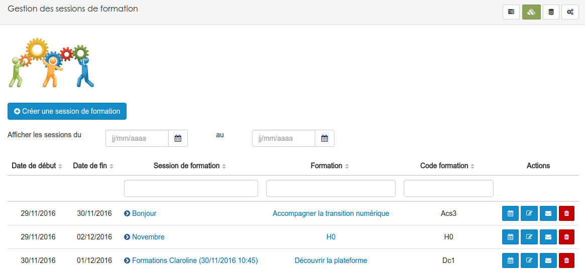
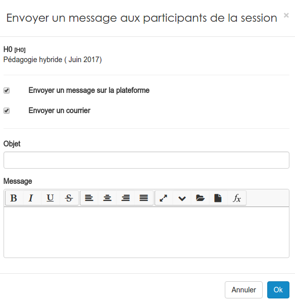

##### Gérer des sessions
---
Dans la pratique, la gestion journalière de  vos formations passera par les sessions. 

Une fois dans le gestionnaire de formation ...

... il vous faudra cliquer sur le deuxième icône du menu supérieur droit pour accéder aux sessions. 

Le menu en haut à droite, vous permet de circuler dans les différentes fonctions du gestionnaire.

Vous arrivez alors sur la page de gestion des séances. Tout comme pour les [formations](admin-trainings.md), les sessions sont présentées sous la forme d'un tableau triable et filtrable.

En regard de chaque session, vous trouverez une série d'actions que vous pouvez effectuer:

* **L'horloge** vous permettra de [créer une séance](create-sessions-events.md).

* **Le crayon avec le carnet** vous permettra comme d'habitude d'entrer en mode édition.

* **L'enveloppe** vous permettra d'envoyer un message à tous les apprenants inscrits de la session.

Ce message peut être envoyé dans la messagerie interne de la plateforme, par mail à l'adresse reprise dans le profil de l'utilisateur ou via les deux méthodes. 

* **Le libre** vous permettra de rejoindre l'espace d'activités liés à la session.

* **La poubelle** vous permettra de supprimer la session.

    
