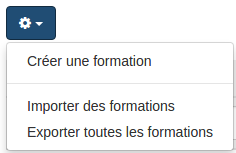

##### Gérer des formations
---
Pour gérer vos formations au quotidien, vous devez vous rendre dans l'administration de la plateforme. Dans ce menu, choisissez "gestion des formations".

Vous arrivez alors dans le gestionnaire de formations.

Le menu en haut à droite, vous permet de circuler dans les différentes fonctions du gestionnaire.

L'icône en vert représente la partie dans laquelle vous vous trouvez: la liste des formations.
Ces formations peuvent avoir été attachées à un ou plusieurs  [cursus](admin-cursus.md) ou être indépendante.

Le menu en haut à gauche (rouage sur fond bleu) vous permet trois choses:

> Attention, l'import export ce fait au format .json. Ce format ne vous permet pas de manipuler/modifier le contenu. Il est destiné à l'archivage ou au transfert entre plateforme.

En descendant plus bas dans la page, on trouve le tableau repenant toutes les formations organisées dans la plateforme.

L'en-tête du tableau vous permet de filtrer sur le titre ou le code d'une formation pour puvoir facilement trouver celle que vous cherchée.

>Il n'est pas possible de filtrer par date à ce niveau, ce qui est logique. Pour rappel, la formation représente l'intitulé, le contenu de votre formation. Ce n'est qu'à la création d'une [session](create-sessions.md)que vous rentrez dans le concret et que vous choisissez des dates. 