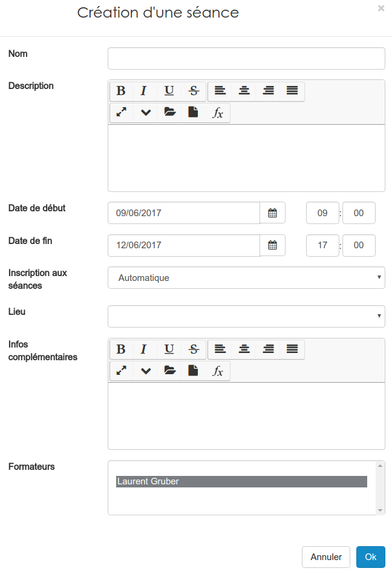

##### Créer des séances
---
Pour créer une séance, il suffit de remplir le formulaire de création. Ce formulaire est disponible depuis la [gestion des séances](admin-sessions-events.md). 

* Vous devez donner un **nom** à votre séance. Veillez à donner un nom explicite par rapport à ce qui s'y déroulera.

* Vous pouvez mettre une **description** mais c'est facultatif.
* Vous devez indiquer **la date et l'heure de début et de fin**.
* Vous pouvez choisir un **lieu** parmi ceux qui sont proposés. Si celui que vous souhaitez n'existe pas, il faut le créer depuis [la gestion des localisations](localisations-config.md). 
* Il est également possible de mettre des **infos complémentaires**: une carte du lieu, le n° du local, le code de la porte d'entrée ...
* Vous pouvez indiquer, en choisissant dans la liste des **formateurs** de la session, qui sont *les intervenants sur cette séance*. 

Il ne vous reste plus qu'à cliquer su "OK" pour créer votre séance.

>> Les informations indiquées pour la séance sont accessibles aux utilisateurs. 
