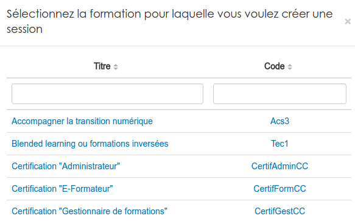
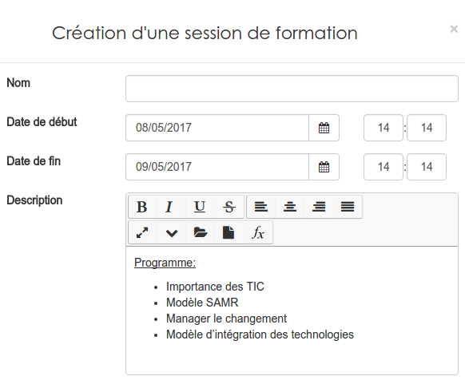
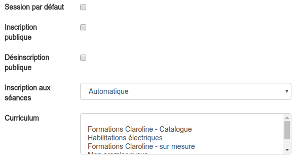
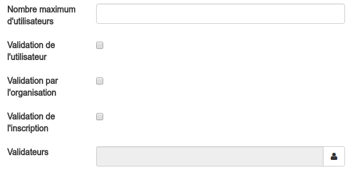

##### Créer des sessions de formation
---
Une session peut être créé depuis plusieurs endroits différents:

* Depuis [la gestion des formations](admin-trainings.md)
* Depuis [l'inscription à des cursus](cursus-inscriptions.md)
* Depuis [la gestion des sessions](admin-sessions.md)

Si vous partez de la gestion des formations, vous devrez d'abord choisir pour quelle formation vous souhaitez créer une session.

Vous pouvez effectuer une recherche via le titre ou le code. Une fois que vous avez trouvez l'intitulé souhaité, il suffit de cliquer dessus pour passer à l'étape suivante.

A ce stade ci, quelque soit votre point de départ, vous serez confronté aux mêmes étapes.

Pour créer une session, vous devrez compléter le formulaire qui vous sera proposé. De nombreux éléments de la configuration sont les mêmes que pour [la création d'une formation](create-trainings.md). Ils seront d'ailleurs pré-complété avec les réglages de la formation liée.

Les paramètres suivants permettent d'affiner les règles d'inscription des utilisateurs:

Il faut donner un **titre**, une **date de début**, une **date de fin**et éventuellement une **description**.

>Contrairement à la formation, vous ne devez pas choisir **La ou les organisation(s)** dont fera partie votre session. En effet, la session étant forcement rattaché à une formation, elle sera liée au même organisation que cette dernière.

Les éléments suivant permettront de définir le comportement avec les utilisateurs.

* **La session par défaut** permet de choisir dans à quelle session les apprenants doivent être ajouté lors de [l'inscription via les cursus](cursus-inscriptions.md). 

* **L'inscription publique** permettra à vos utilisateurs, depuis le widget [catalogue de formations](formationslisting.md) de s'inscrire à une [session](admin-sessions.md) de cette formation.

* **Désinscription publique**, sur le même principe que l'inscription permettra à vos utilisateurs d'annuler leur inscription.

* **L'inscription aux séances** permet de définit le comportement par défaut des inscription à une séance.
 * Automatique : les inscrits à la session sont automatiquement inscrit à la séance
 * Manuelle : le gestionnaire/formateur doit inscrire lui-même les utilisateurs dans les séances
 * Publique : les utilisateur s'inscrivent eux-même, depuis [le catalogue de formation](widget-formationslisting.md) ou l'outil ["gestion des séances"](session-event-manager.md)

* **Le curriculum** vous permet de rattacher votre séance à un cursus, si la formation ne l'est pas déjà.

Les paramètres suivants permettent d'affiner les règles d'inscription des utilisateurs:

* **Le nombre maximum d'utilisateurs** correspond au nombre d'utilisateurs qui peuvent être inscrits. Lors d'une demande d'inscription, si la limite est atteinte, l'utilisateur est notifié et mis en liste d'attente.

* **Validation de  l'utilisateur** oblige l'utilisateur à confirmer sa demande d'inscription via un mail envoyer à l'adresse reprise dans son profil.

* **Validation par l'organisation** nécessite qu'un gestionnaire de l'organisation valide la demande d'inscription.
* **Validation de l'inscription** demande qu'une personne ayant accès à la [gestion des inscriptions](insriptions-admin.md)valide la demande.

* **Validateurs** permet de nommer des personnes en particulier qui doivent valider la demande d'inscription.

> Comme d'habitude, un administrateur plateforme peut effectuer toutes les validations par lui-même. 

