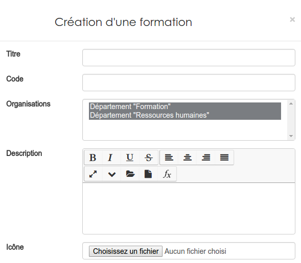
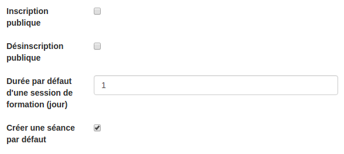
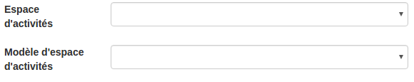
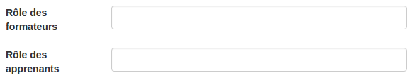
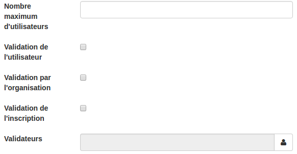
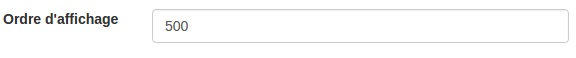

##### Créer des formations
---
La création des formations peuvent s'effectuer depuis deux endroits:
* La page de [gestion des formations](admin-trainings.md).
* La page de [création des cursus](create-cursus.md).

Dans un cas comme dans l'autre, une fois que vous aurez cliqué pour créer une nouvelle formation vous serez amené à remplir le même formulaire. C'est également via ce formulaire que vous pouvez modifier les configurations de la formation en mode "édition"

La première partie du formulaire est assez semblable à ceux que vous pouvez trouver ailleurs dans la plateforme:

Il faut donner un **titre**, un **code** qui doit être unique et éventuellement une **description** et une **icône** pour représentée la formation. Cette icône apparaîtra notamment dans les widgets. 

Comme pour le cursus, vous devez choisir **La ou les organisation(s)** dont fera partie votre cursus. Vous ne pouvez choisir que parmi les organisations dont vous êtes membre. 

Il vous faut ensuite définir les configurations de base qui seront attribuées aux sessions que vous organiserez pour cette formation:

* **L'inscription publique** permettra à vos utilisateurs, depuis le widget [catalogue de formations](formationslisting.md) de s'inscrire à une [session](admin-sessions.md) de cette formation.

* **Désinscription publique**, sur le même principe que l'inscription permettra à vos utilisateurs d'annuler leur insription.

* **La durée par défaut de la session** permet de préciser combien de temps dure généralement une session de cette formation. Cela vous évite de configurer systèmatiquement cette information pour chaque nouvelle [session](create-sessions.md). 

* **Créer une séance par défaut** [créera automatiquement une séance](create-sessions-events.md) dans la session. Cette séance commencera avec le début de la session et se terminera avec la fin de la session. 
>Cette configuration n'a du sens que si vous ne voulez pas utiliser les séances ou que votre formation se donne en une seule séquence continue. 

Dans la partie suivante, vous allez pouvoir configurer le lien qui sera créé entre la session de formation et l'espace d'activité dédié.

> Pour rappel,ce n'est qu'à partir de la session qu'on est dans le concret. C'est donc bien ce niveau qui est rattaché à un espace d'activités et jamais la formation elle-même.

Trois options sont possibles:
* **Ne rien faire**. Dans ce cas, à chaque nouvelle [session](create-sessions.md), un espace d'activités complètement vide sera créé et attaché la session. 

* **Sélectionner un espace d'activité existant**. Si vous faites cela, les utilisateurs de toutes vos sessions seront inscrits dans le même espace d'activités. A savoir, celui que vous avez sélectionné. Cela signifie qu'à chaque nouvelle session, les nouveaux participants auront accès aux informations laissées par les précédents.

* **Sélectionner un modèle**. Pour chaque nouvelle [session](create-sessions.md), un nouvel espace d'activités sera créé. Néanmoins contraitement à la première option, il ne sera pas vide, il contiendra une copie de ce que vous avez mis dans le modèle. 

Les 2 champs suivants ne sont utiles que si vous avez utilisé un espaces d'activités existant ou un modèle.  Dans ces cas là, les cadre sont remplacés par des listes déroulantes vous permettant de choisir le rôle qui doit être attribué aux formateurs et aux apprenants lors de leur inscription dans l'espace d'activités. 

Les paramètres suivants permettent d'affiner les règles d'inscription des utilisateurs:

* **Le nombre maximum d'utilisateurs** correspond au nombre d'utilisateurs qui peuvent être inscrits. Lors d'une demande d'inscription, si la limite est atteinte, l'utilisateur est notifié et mis en liste d'attente.

* **Validation de  l'utilisateur** oblige l'utilisateur à confirmer sa demande d'inscription via un mail envoyer à l'adresse reprise dans son profil.

* **Validation par l'organisation** nécessite qu'un gestionnaire de l'organisation valide la demande d'inscription.
* **Validation de l'inscription** demande qu'une personne ayant accès à la [gestion des inscriptions](insriptions-admin.md) valide la demande.

* **Validateurs** permet de nommer des personnes en particulier qui doivent valider la demande d'inscription.

> Comme d'habitude, un administrateur plateforme peut effectuer toutes les validations par lui-même. 

Le dernier champ permet de définir un numéro d'ordre pour gérer l'affichage dans certains outils de la plateforme comme le bulletin.

