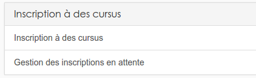
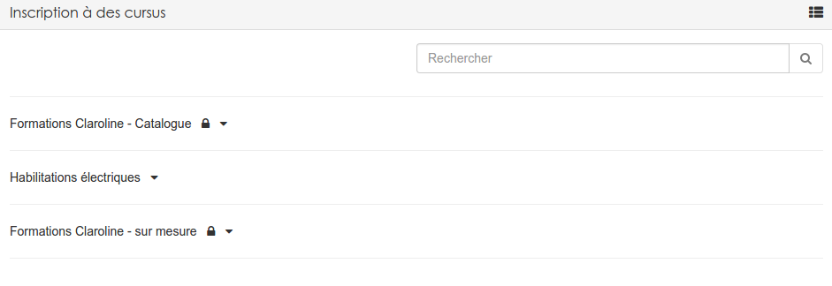
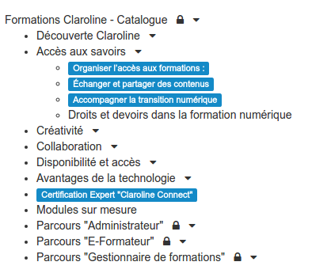
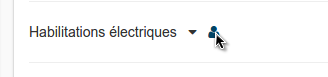
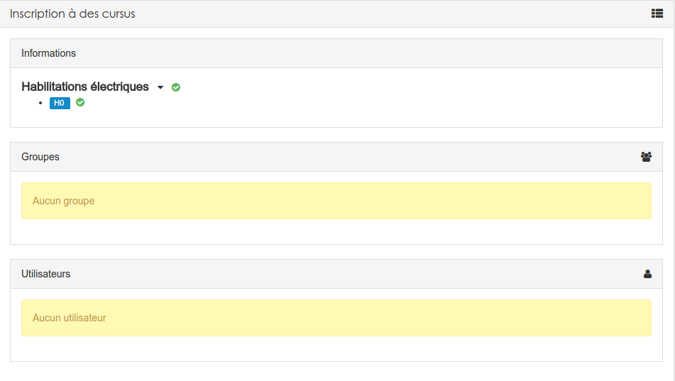
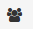
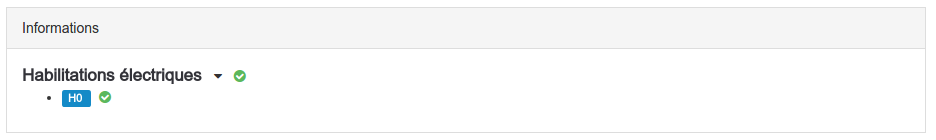
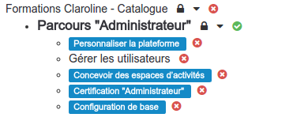
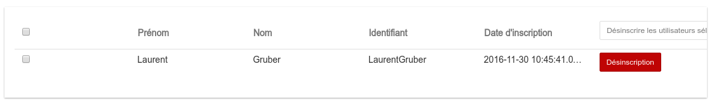
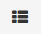

#### Inscription à des cursus
---
Pour accéder à "l'inscription à des cursus" il faut vous rendre dans le menu "administration" de la plateforme et cliquer sur le lien du même nom.

Vous arriverez alors sur l'écran suivant:

La première option vous permet d'inscrire manuellement des utilisateurs ou des groupes à [des cursus](admin-cursus.md).

La seconde option vous permet d'accepter ou de refuser les demandes d'inscription faites depuis le [widget "Catalogue de formation"](widget-formationslisting.md).

##### Inscription à des cursus

Si vous avez cliqué sur la première option, vous arriverez sur un tableau reprenant la liste des [cursus que vous avez créés](create-cursus.md).  

Vous pouvez évidement accéder au sous-cursus, il suffit pour cela de cliquer sur la flèche noire à l'extrémité du nom du cursus parent. Cela aura pour effet d'ouvrir l'arborescence de votre [cursus](create-cursus.md).

Ensuite,pour inscrire, rien de plus simple. Il suffit de placer votre souris à coter du nom [du cursus] ou du sous-cursus(admin-cursus.md) et de cliquer quand la silhouette bleue apparait. 

Vous avez alors accès à un tableau reprenant toutes les inscriptions à ce cursus.

A vous de cliquer sur le bouton

pour inscrire des groupes ou sur le bouton

pour inscrire des utilisateurs isolés.

Les utilisateurs ou les groupes seront alors automatiquement inscrits à toutes les formations, reprise dans l'encadrée "informations" à côté desquelles se trouve le petit "v" sur fond vert. 

Si certaines formations sont suivies d'une croix sur fond rouge, cela signifie que des blocages ont été paramétrés depuis le [cursus](create-cursus.md). Les utilisateurs/groupes ne seront donc pas inscrits à ces formations. 

Si certains utilisateurs/groupes sont déjà inscrits, vous pouvez évidemment les visualiser et si nécessaire les désinscrire depuis cet écran.

>>Un petit bouton en haut à droite de l'écran vous permet de basculer vers la gestion des inscriptions en attente. 

##### Gestion des inscriptions en attente