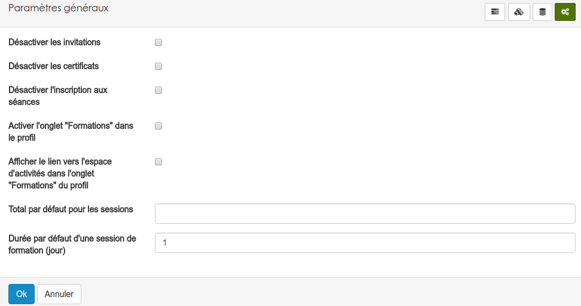

#### Paramétres généraux
---

Depuis ce menu, vous pourrez configurer certains comportements.

* Désactiver les invitations fera disparaître le bouton "générer une invitation" des différents menu où il est présent.

* Désactiver les certificats fera disparaître le bouton "générer un certificat" des différents menu où il est présent.

* Désactiver l'inscription aux séance, désactivera l'ensemble du système d'inscription aux séances.

* Activer l'onglet "formations" ajoutera dans les profils de tous les utilisateurs un onglet incluant la liste de toutes les formations terminées dans lequel l'utilisateur était inscrit.

* Afficher le lien, ajoutera à côté de chaque formation de l'onglet précédemment un lien vers l'espace d'activités qui y était lié. 

* Total par défaut, permet de définir la note maximum attribuable à une session de formation. Cette fonction est utilisée dans certains outils complémentaires de la plateforme. 

* Durée de formation, permet de définir la durée par défaut de chaque session qui sera créée. Cette valeur sera bien évidemment modifiable pour chaque session. 