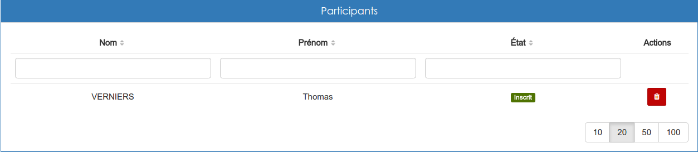

#### Inscriptions aux séances
---
Selon les réglages qui ont été faits, il est possible que vous ayez besoin de gérer les inscriptions aux séances d'une session donnée.

Il est possible, en cliquant sur le nom d'une séance, depuis [la gestion d'une session](admin-sessions.md), d'ouvrir la page de gestion complète d'une séance.

En cliquant sur son titre, vous pouvez ouvrir le panneau de gestion des participants.

Vous avez alors accès à la liste des inscrits à la séance sous forme de tableau. En cliquant sur la poubelle sur fond rouge, vous pouvez désinscrire un utilisateur.

Si vous souhaitez inscrire un utilisateur supplémentaire, il faut vous rendre dans la barre d'action situé en haut à droite de la page.

Un clique sur la silhouette avec un plus vous permettra de sélectionner les utilisateurs que vous voulez ajouter.

>> Vous ne pouvez inscrire à une séance que des utilisateurs qui sont [inscrits à la session parente](inscriptions-sessions.md). 