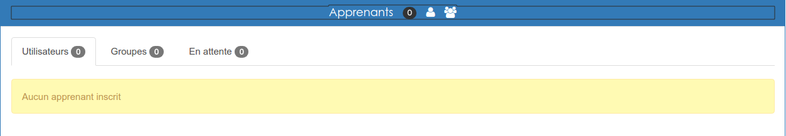
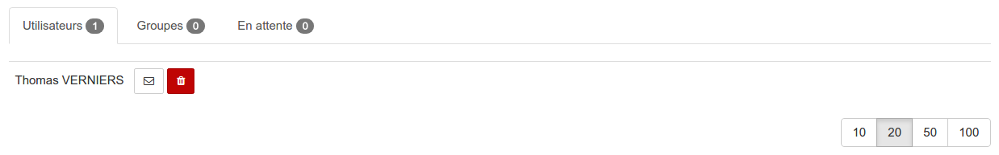
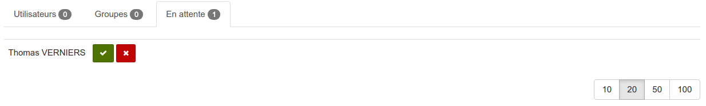
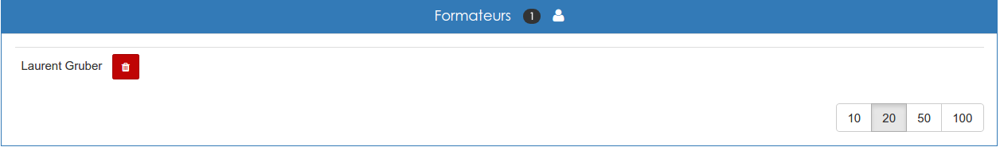

#### Inscriptions aux sessions
---
Est est également possible de gérer les inscriptions directement depuis [la page d'une session particulière](admin-sessions.md).

Deux cadres sont dédiés aux inscriptions, l'un pour inscrire les apprenants (collaborateur dans l'espace d'activités lié) et l'autre pou inscrire les formateurs (gestionnaire dans l'espace d'activités lié): 

###### Apprenants

Cette section s'ouvre sur 3 onglets. Le premier permet d'afficher la liste des utilisateurs inscrits.

Depuis cette liste, vous pouvez facilement désinscrire un utilisateur ou lui envoyer (en cliquant sur l'enveloppe) une confirmation manuelle de son inscription.

Le second onglet vous permet, de la même manière que pour les utilisateurs, de gérer des groupes.

Le dernier onglet, celui intitulé "**En attente**" vous permet d'accepter ou de refuser les demandes d'inscription qui ont été faites depuis [le catalogue](widget-formationslisting.md). 

Pour inscrire, rien de plus simple dans la barre de titre:

Vous cliquez sur la silhouette seule pour inscrire des utilisateurs isolés, ou sur le trio de silhouettes pour inscrire un groupe.

>> La valeur indiquée sur fond gris indique le nombre d'inscrits à la session.

###### Formateurs

Le principe est le même pour gérer et inscrire les formateurs. 

>>Il y a par contre deux petites nuances, il n'est pas possible d'inscrire les formateurs par groupes et il n'est pas possible d'envoyer une confirmation aux formateurs. 

