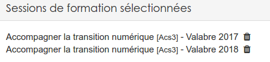

#### Inscriptions par utilisateur
---
Pour gérer les inscriptions utilisateur par utilisateur, il faut vous rendre dans le menu "administration" de la plateforme et accèder au menu "gestion des utilisateurs".

Dans le tableau qui vous sera proposé, vous trouverez la liste de tous les utilisateurs de la plateforme. Dans la dernière colonne, celle des actions, vous trouverez le bouton suivant:

En cliquant dessus, vous aurez la liste des inscriptions liés à l'utilisateur choisi.

Vous pouvez constater que l'affichage se divise en deux parties:

Les inscriptions comme **apprenant** et les inscriptions comme **formateur**. Au niveau de l'espace d'activités lié à la session, cela correspond aux rôles **collaborateur** ou **gestionnaire**.

Pour chaque session listée, une série d'action est possible:

**Le plus** permet de générer une invitation à la session uniquement pour l'utilisateur courant. Le format de l'invitation dépend [des modèles que vous avez créés]models-config.md().  

**Le chapeau d'étudiant** permet de générer une attestation de participation à la session uniquement pour l'utilisateur courant. Le format de l'attestation dépend [des modèles que vous avez créés]models-config.md().  

**La croix sur fond rouge** permet de désinscrire l'utilisateur pour la session en question. 

Si vous travaillez avec des séances, il suffit de cliquer sur le nom de la session pour les afficher. Les actions possibles sont alors les même que pour le niveau "session"

Pour ajouter de nouvelle inscription, il vous faut cliquer sur le bouton "Inscription" en haut à droite du tableau. Vous aurez alors la possibilité de choisir toutes les sessions celles auxquelles vous voulez inscrire l'utilisateur.

Au fur et à mesure que vous sélectionnez des sessions, elles sont listées dans le cadre "Sessions de formation sélectionnées"

Il ne vous reste plus qu'à cliquer sur "Ok" en bas de page pour valider l'inscription. 

