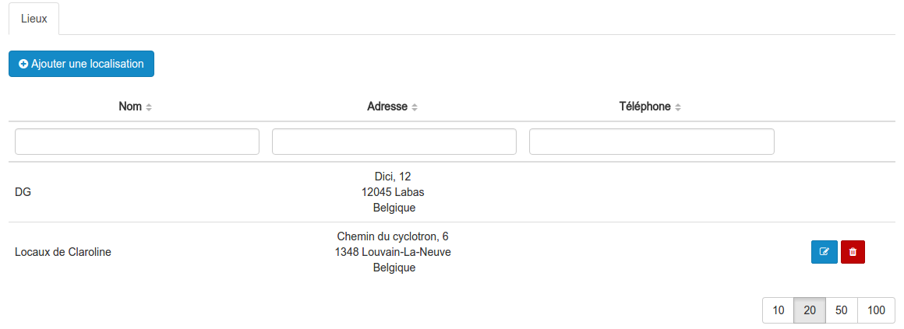
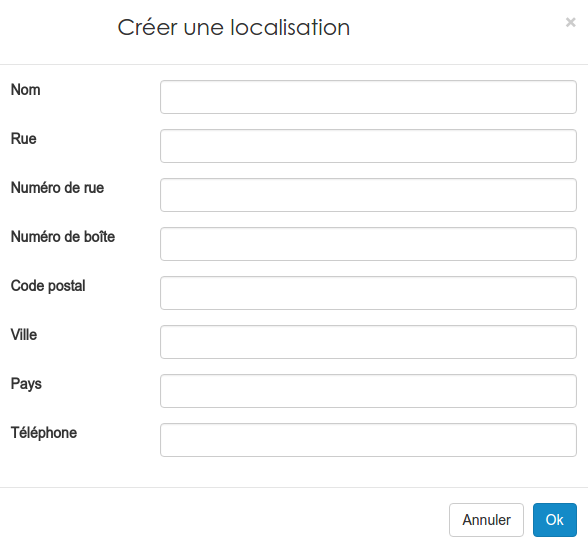

#### Gérer les localisations
---

Lorsque vous organisez des séances, il est parfois nécessaire de préciser le lieu du rendez-vous. 

Afin de ne pas devoir systématiquement encoder les mêmes données pour les même lieux. Vous pouvez enregistrer ces derniers une fois pour toute.

Dans cette liste, vous pouvez trouver deux types de lieux, ceux que vous pouvez éditer/supprimer et les autres.

Ceux que vous ne pouvez pas modifier sont en réalité des lieux qui ont été encodé au depuis la gestion des organisations.

Si le lieux que vous souhaitez utilisé n'existe pas encore, il suffit de l'ajouter en cliquant sur le bouton bleu en haut à gauche "Ajouter une localisation"

Vous devrez ensuite remplir le formulaire suivant:

Il ne reste plus qu'à cliquer su "ok" pour rendre ce lieu utilisable dans la [configuration de vos séances](create-sessions-events.md). 

