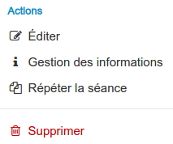

##### Outil "Gestion des séances"
---
Si votre espace d'activités est rattaché à une session de formation, vous pouvez depuis l'outil "gestion des séances", créer, organiser et gérer les inscriptions à vos séances, ateliers, rendez-vous. 

Pour cela rien de plus simple, rendez-vous dans votre espace d'activités et dans le menu latéral gauche, cliquez sur le dernier icône, celui qui représente une horloge. 

Une fois dans l'outil, vous aurez accès à toutes les séances organisées pour votre session de formation, certaines d'entre-elles peuvent avoir été créées par le gestionnaire de formation de votre institution.

Un champ de recherche vous permet de filtrer les différentes séances.

Au bout de chaque ligne se trouve trois petits points empilés, en cliquant sur cette icône, vous ouvrez le menu contenant les actions possibles.

* **Le crayon** permet d'éditer la séance, vous aurez alors accès au même formulaire que lors de la [création de la séance](create-sessions-events.md).
* **L'icône "i"** vous permet de consulter, ajouter, éditer ou encore supprimer des commentaires sur la séance.

>Ces commentaires sont visibles par les utilisateurs.

* **La pile de feuilles** permet de répéter la séance.

Vous pouvez choisir les jours de répétition et la date de fin ou ou la durée des répétitions. Une fois votre sélection validée, votre séance sera dupliquée autant de fois que nécessaire.

* **La poubelle** permet comme toujours de supprimer.

En cliquant sur le titre d'une séance, vous affichez une page de gestion détaillée.

En plus des actions déjà présentées, vous pouvez ajouter des inscrits à votre séance en cliquant sur le bonhomme accompagné d'un "+".

Si vous souhaitez ajouter une séance, il faut utiliser **le bouton "créer une séance"** en bas à gauche de la liste des séances.

Il vous suffit alors de remplir le formulaire et de valider pour que votre séances soit créée.

* Vous devez donner un **nom** à votre séance. Veillez à donner un nom explicite par rapport à ce qui s'y déroulera.

* Vous pouvez mettre une **description** mais c'est facultatif.
* Vous devez indiquer **la date et l'heure de début et de fin**.
* Vous pouvez choisir un **lieu** parmi ceux qui sont proposés. Si celui que vous souhaitez n'existe pas, il faut demander sa création par un gestionnaire de formations/administrateur depuis [la gestion des localisations](localisations-config.md). 
* Il est également possible de mettre des **infos complémentaires**: une carte du lieu, le n° du local, le code de la porte d'entrée ...
* Vous pouvez indiquer, en choisissant dans la liste des **formateurs** de la session, qui sont *les intervenants sur cette séance*. 

Il ne vous reste plus qu'à cliquer su "OK" pour créer votre séance.

>> Les informations indiquées pour la séance sont accessibles aux utilisateurs. 

