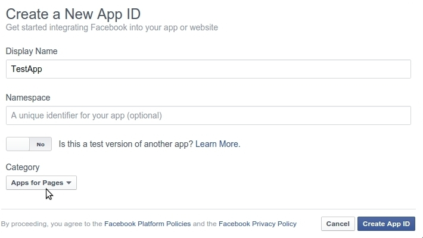
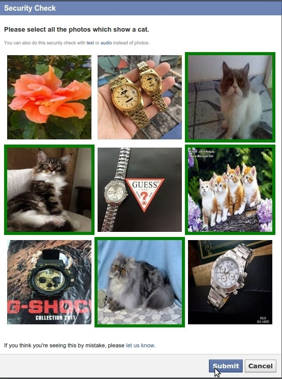
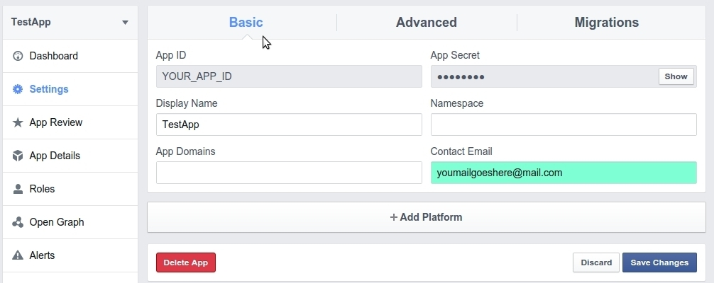
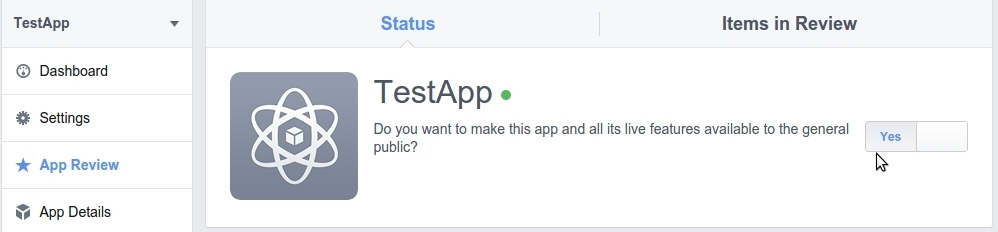

### Enregistrer et configurer une App Facebook

---

Commencez par vous connecter à Facebook.

Allez à Facebook Developers Apps. Vous avez besoin d'un compte Facebook Développeur pour démarrer. Si vous n'en avez pas, mettez votre compte Facebook personnel à jour vers un compte Facebook Développeur.

Cliquez sur le bouton **+ Ajouter une app** ou utilisez le menu déroulant **Mes apps** et choisissez **Ajouter une app**.

Donnez un nom à votre App dans le champ "Display Name", choisissez **Applications pour les Pages** comme **Catégorie** et cliquez pour **Créer une ID d'app**.

Complétez le **Security Check**.

Votre App est créée à présent! Copiez l'ID de l'App et le Secret de l'App du tableau de bord et copiez-les dans Claroline: Administration -&gt; Paramètres de la platforme -&gt; Oauth -&gt; Facebook.

Remplissez les champs \*\*ID de l'application" et "Secret de l'application".

Configurez à présent votre App. Allez dans les **Paramètres**, donnez un courriel valide dans l'onglet "Basic" et cliquez sur **Save changes**.

Allez dans l'onglet **Advanced** et sélectionnez **Client OAuth Settings**. Choisissez l'option **Embedded Browser OAuth Login** et pour le **Valid OAuth redirect URL**, écrivez votre URL sous la forme suivante: [http://YOUR\_DOMAIN\_NAME/login/check-facebook](http://YOUR_DOMAIN_NAME/login/check-facebook)

Exemple:

[http://3l.claroline.com/login/check-facebook](http://3l.claroline.com/login/check-facebook)

Allez sur **App Review** et à la question _"Do you want to make this app and all its live features available to the general public?"_, répondez **Yes** de façon à publier votre App.

Félicitations! Vous avez configuré votre App Facebook!

