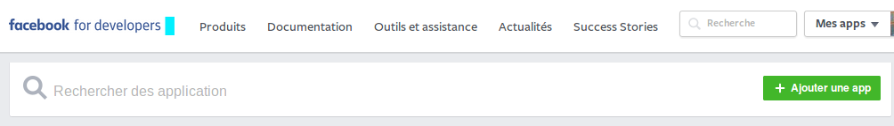
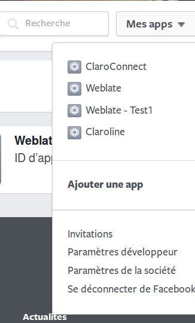
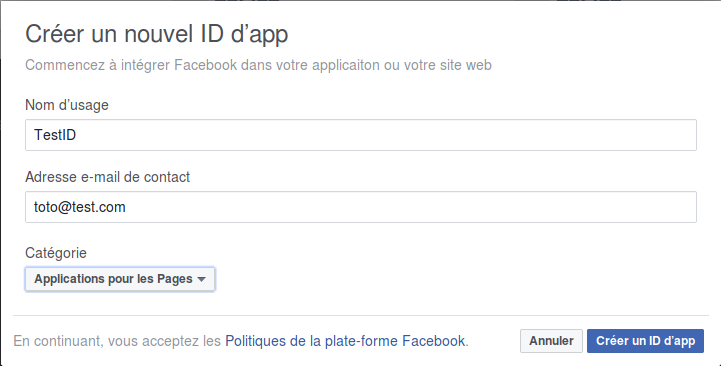
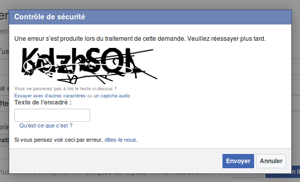
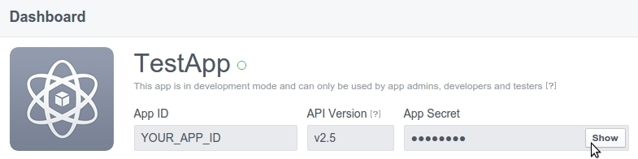
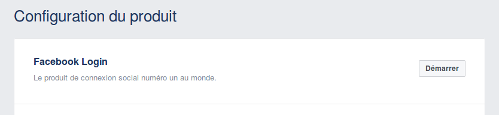
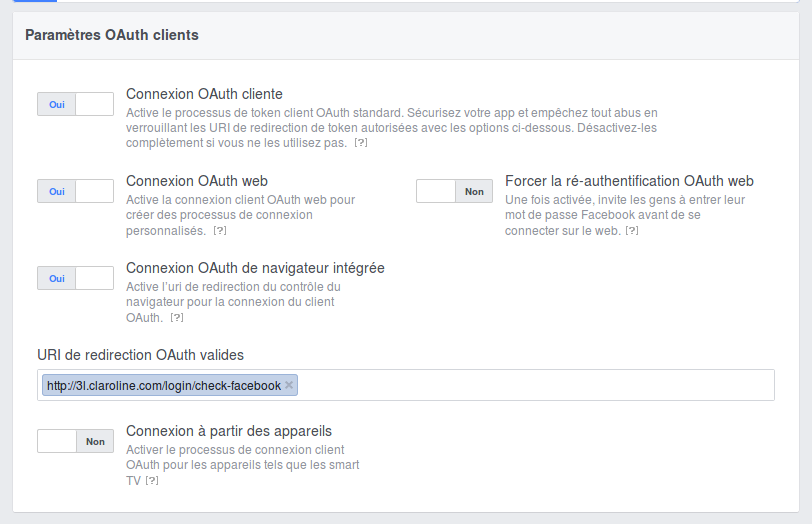
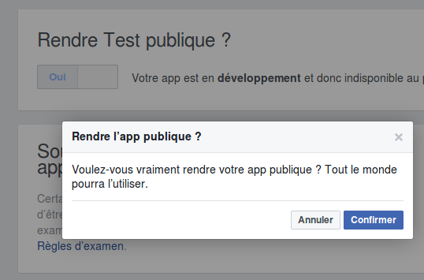

### Enregistrer et configurer une App Facebook

---

Commencez par vous connecter à Facebook.

Allez à Facebook Developers Apps. Vous avez besoin d'un compte Facebook Développeur pour démarrer. Si vous n'en avez pas, mettez votre compte Facebook personnel à jour vers un compte Facebook Développeur.

Cliquez sur le bouton **+ Ajouter une app** ou utilisez le menu déroulant **Mes apps** et choisissez **Ajouter une app**.

Donnez un nom à votre App dans le champ "Display Name", choisissez **Applications pour les Pages** comme **Catégorie** et cliquez pour **Créer une ID d'app**.

Vous aurez à passer un contrôle de sécurité. Recopiez le texte de l'encadré et appuyez sur **Envoyer**.

Vous arrivez alors sur la page de configuration de votre app. Dans son **tableau de bord**, vous trouverez l'ID de l'app et sa clé secrète. Pour voir cette dernière, vous devrez vous réauthentifier sur Facebook au moyen du mot de passe de votre compte.

Copiez l'ID de l'App et le Secret de l'App du tableau de bord et copiez-les dans Claroline: **Administration -&gt; Paramètres de la plateforme -&gt; Oauth -&gt; Facebook**.

Remplissez les champs \*\*ID de l'application" et "Secret de l'application".

Retournez dans Facebook pour développeurs.

Cliquez sur **+ Ajouter un produit** et sur **Démarrer** à côté de **Facebook login** dans la **Configuration du produit**.

Répondez **Oui** ou **Non** selon la figure ci-dessous et n'oubliez pas de mentionner votre URL de redirection sous la forme suivante: [http://YOUR\_DOMAIN\_NAME/login/check-facebook](http://YOUR_DOMAIN_NAME/login/check-facebook)

Exemple:

[http://3l.claroline.com/login/check-facebook](http://3l.claroline.com/login/check-facebook)

Dernière étape: Dans le menu **Examen des apps**, à la question _"Rendre VotreNomApp publique?"_, répondez **Oui** de façon à publier votre App. Vous devrez alors confirmer votre choix.

Félicitations! Vous avez configuré votre App Facebook!

