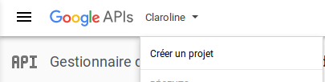
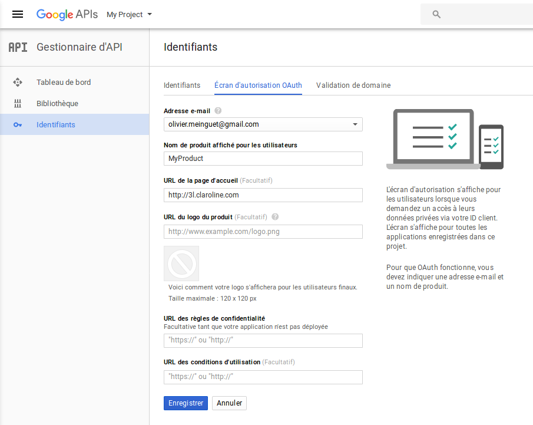
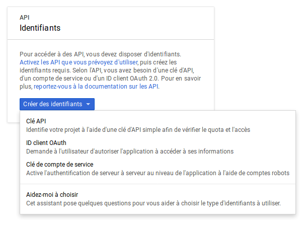
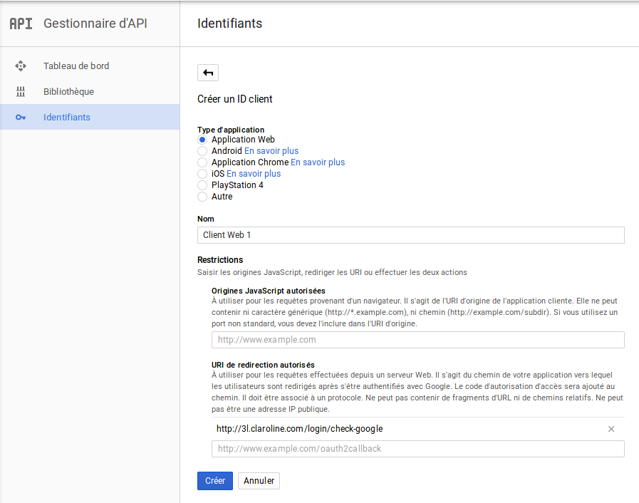
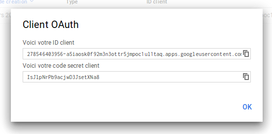

### Enregistrer et configurer une Application Google
---

1. Connectez-vous à [Developpers Console](https://console.developers.google.com) avec votre compte Google.

2. Cliquez sur **Créer un projet**.

3. Donnez un nom à votre projet et cliquez sur **CRÉER**.

4. Dans le tableau de bord de votre projet, cliquez sur **Identifiants** puis sur **Écran d'autorisation OAuth**. Indiquez le nom de produit qui sera affiché pour les utilisateurs et l'URL de votre page d'accueil. Cliquez sur **Enregistrer**.

5. Dans **Identifiants**, choisissez **ID client OAuth** dans le menu déroulant **Créer des identifiants**.

6. Choisissez **Application Web**, donnez un **Nom** et une URL de redirection au format:

    http://VOTRE_NOM_DE_DOMAINE/login/check-google

    Exemple: http://3l.claroline.com/login/check-google

Dès que vous avez cliqué sur **Créer**, vous recevez votre clé et votre secret dans une modale. Vous pouvez les copier-coller dans **Administration -> Paramètres de la plateforme -> Oauth -> Google** grâce au petit bouton à leur droite dans la modale.

Vous pouvez les retrouver plus tard dans le menu **Identifiants**.