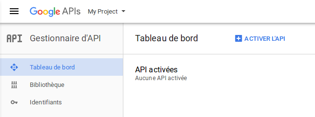
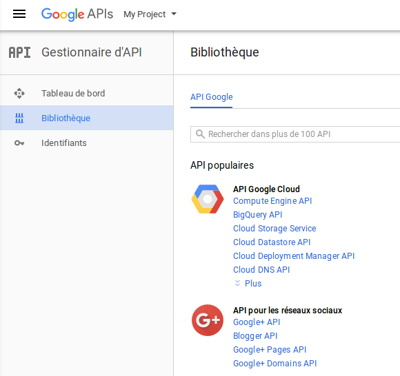

## Enregistrer et configurer une Application Google
---


1. Connectez-vous à [Developpers Console](https://console.developers.google.com) avec votre compte Google.

2. Cliquez sur **Créer un projet**.


3. Donnez un nom à votre projet et cliquez sur **CRÉER**.


4. Dans le tableau de bord de votre projet, cliquez sur **Identifiants** puis sur **Écran d'autorisation OAuth**. Indiquez le nom de produit qui sera affiché pour les utilisateurs et l'URL de votre page d'accueil. Cliquez sur **Enregistrer**.


5. Dans **Identifiants**, choisissez **ID client OAuth** dans le menu déroulant **Créer des indentifiants**.


6. Choisissez **Application Web**, donnez un **Nom** et une URL de redirection au format:

    http://YOUR_DOMAIN_NAME/login/check-google

    Exemple: http://3l.claroline.com/login/check-google


** + ACTIVER L'API**.



5. Choisissez Google+ API dans la catégorie **API pour les réseaux sociaux**.




and **edit** your **project ID** to something related to your project. Click on **Show advanced options...** and choose your App location e.g. europe_west (if your App will be mostly used by users in Europe). Click **Create** to register your App.
![Choose basic setup][new_app_form]

4. Once your Project is created you are redirected to the Project Dashboard. Click on **Enable and manage APIs**.
![Go to API manager][new_app_api]
You can alse access the API manager through the sidemenu bar
![Sidebar API manager][new_app_api2]

6. In the API Manager window click on **Credentials** tab on the right and then on **OAuth consent screen** tab on the top (see pic below).
Provide a **Product name** that will be shown to users and any other information you wand to display (homepage URL, logo etc.). Save your options.
![OAuth consent screen][new_app_oauth_sonsent_screen]

6. Now head over to the **Credentials** tab on the top and generate **New credentials** for **OAuth client ID** (As shown in pic below)
![OAuth client ID credentials][new_app_new_credentials]


8. Your App is now created! Copy the `Client ID` and `Client Secret`.
You can paste them to Claroline:
```Administration -> Platform Settings -> Oauth -> Google```
![App ID and Secret][new_app_id_secret]
_Note that you can find your credentials any time by clicking on your client name in the **Credentials** tab._

##### Congratulations you have now registered and configured your Google App!

[new_app_menu]: images/google/google_new_app_menu.jpg "New app via dropdown menu"
[new_app_form]: images/google/google_new_app_form.jpg "Fill in the form for you new App/Project"
[new_app_api]: images/google/google_new_app_api.jpg "Go to API Manager"
[new_app_api2]: images/google/google_new_app_api2.jpg "Go to API Manager (alternative)"
[new_app_oauth_sonsent_screen]: images/google/google_new_app_oauth_consent.jpg "Fill in you OAth consent info"
[new_app_new_credentials]: images/google/google_new_app_credentials_gen.jpg "Generate new credentials"
[new_app_client_id]: images/google/google_new_app_client_id.jpg "Provide your client info"
[new_app_id_secret]: images/google/goole_api_credentials_screen.jpg "You App/Client credentials"