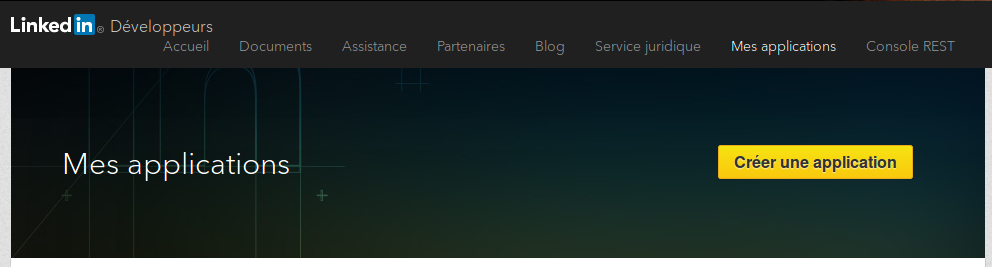
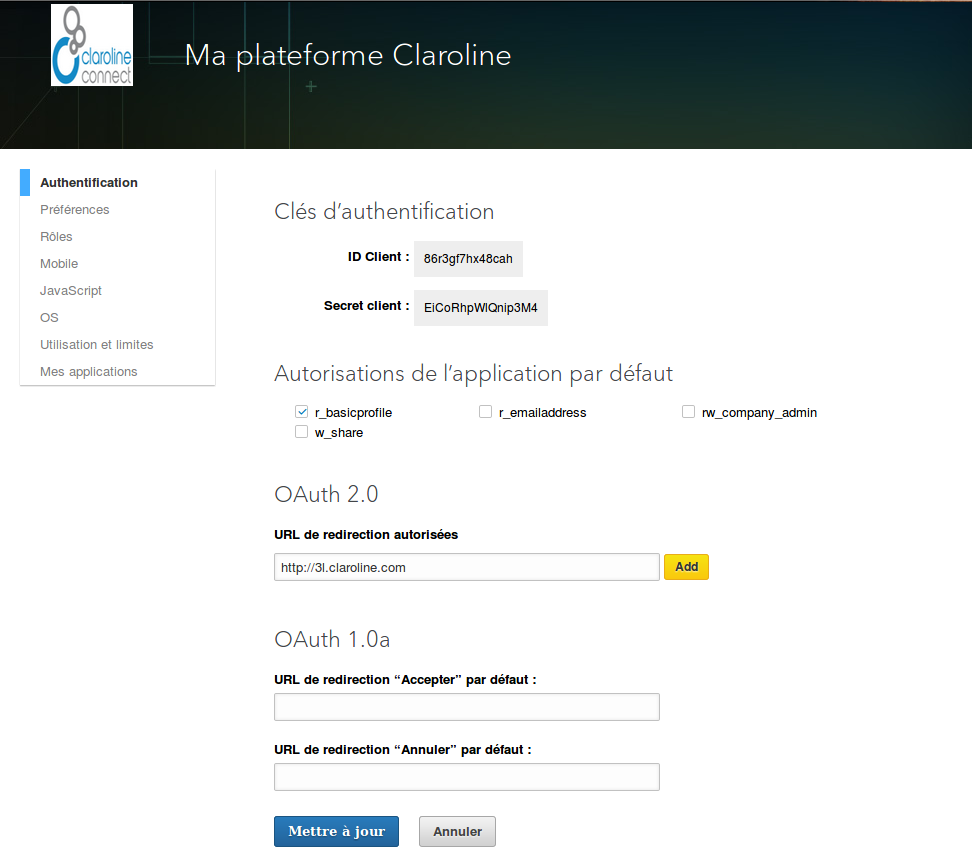

### Enregistrer et configurer une App LinkedIn
---

Connectez-vous au portail page [LinkedIn Developers](https://developer.linkedin.com/#) et cliquez sur My Apps dans barre de menu supérieure.

Cliquez sur **Créer une application**.

Remplissez toutes les données, cochez la case **J’ai lu et j’accepte les Conditions générales de LinkedIn API** et cliquez sur **Envoyer**.

Votre application est créée et vous êtes redirigé vers la page d'administration de votre app.

Vous y trouvez votre ID client et votre Secret client. Pour un fonctionnement optimal de votre app, assurez-vous que **r_basicprofile** et **r_emailaddress** sont cochés.

Fournissez une URL de redirection valide et autorisée sous la forme:

    http://YOUR_DOMAIN_NAME/login/check-linkedin

    e.g. http://myclaroline.univ-lyon.fr/login/check-linkedin

Sur votre plateforme, copiez-collez votre ID client et votre Secret client dans **Administration -> Paramètres de la plateforme -> OAuth -> LinkedIn**

Et voilà le travail !