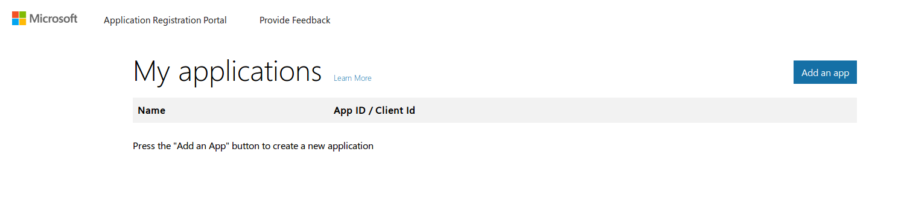
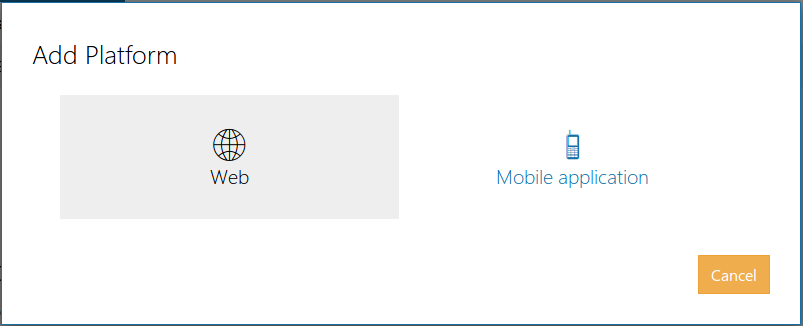

### Enregistrer et configurer une App Office 365
---

* Connectez-vous au [Microsoft account Developer Center](https://apps.dev.microsoft.com/#/appList) à l'aide de vos identifiants Windows et cliquez sur **Add an app**.

* Donnez un nom à votre application et cliquez sur **Create application**.

* Votre application est créée et vous êtes redirigé vers la page de configuration de votre app.

Vous y trouvez votre **Application ID**.

* Cliquez sur **Generate New Password** pour obtenir un mot de passe correspondant au secret à copier-coller sur votre plateforme dans **Administration -> Paramètres de la plateforme -> Oauth -> Windows Live**.

* Cliquez sur **Add Pplatform** dans la section **Platforms**.

* Choisissez **Web**.

* Remplissez l'URL de redirection au format :
    
    http://VOTRE_NOM_DE_DOMAINE/login/check-o365

    Exemple: http://3l.claroline.com/login/check-o365

* Remplissez éventuellement les informations dans la section **Profile** et cliquez sur **Save**.
