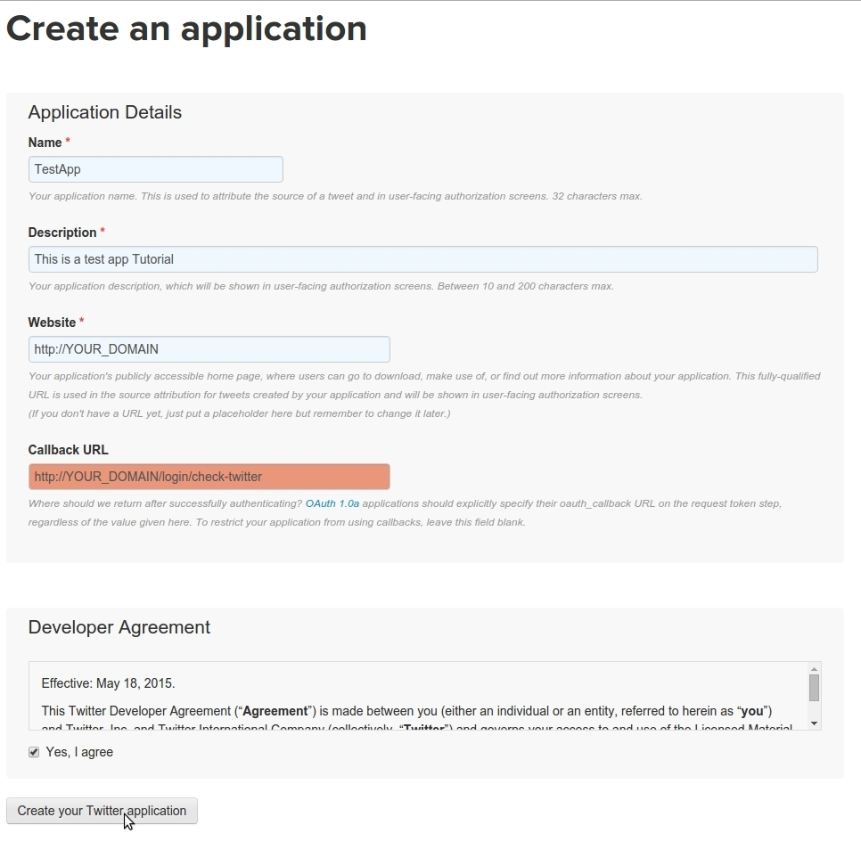
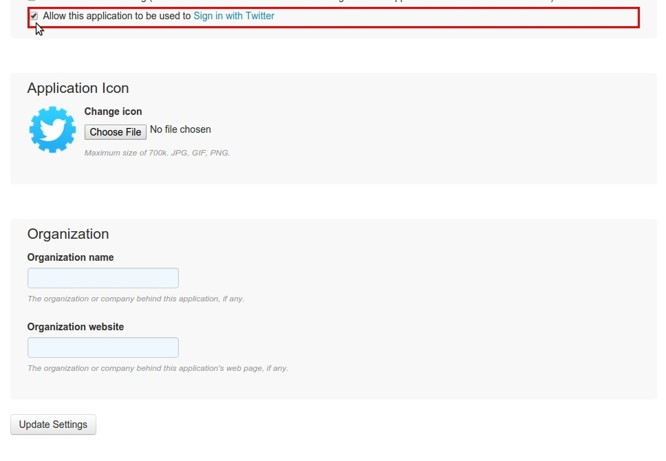
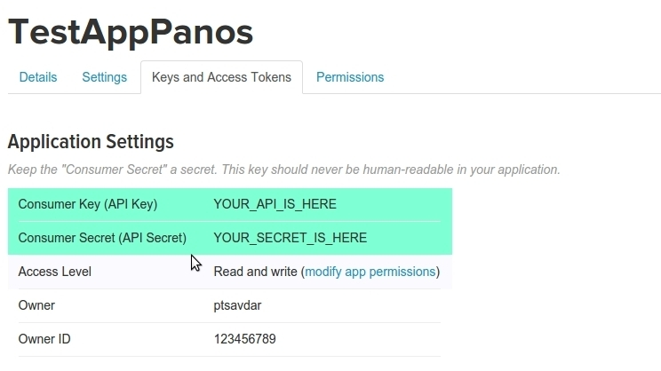
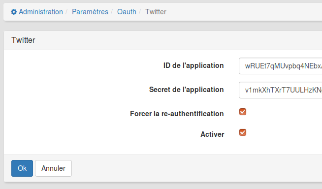

### Enregistrer et configurer une App Twitter

1. Connectez-vous à [Twitter](https://www.twitter.com/)

2. [Créez un nouvelle App Twitter](https://apps.twitter.com/app/new). Fournissez les détails de l'application: **Name**, **Description**, **Website** and **Callback URL**. Votre URL de redirection ressemble à ceci:

```
    http://YOUR_DOMAIN_NAME/login/check-twitter

    e.g. http://3l.claroline.com/login/check-twitter

```



1. Quand votre App est créée, allez dans l'onglet  **Settings** (paramètres) et cochez la case **Allow this application to be used to Sign in with Twitter**. Vous pouvez aussi fournir une **icône** pour votre App, ainsi que le **nom de votre organisation** et votre **site web**. Cliquez sur **Update settings**.



2. Cliquez sur l'onglet  **Keys and Access Tokens** et copiez-collez l'App ID et le Secret dans Claroline: **Administration -> Paramètres de la platforme -> Oauth -> Twitter**.





##### Félicitations: vous avez créé et configuré votre App Twitter!


