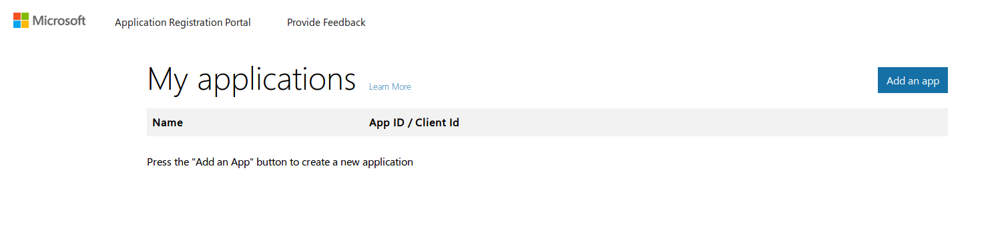
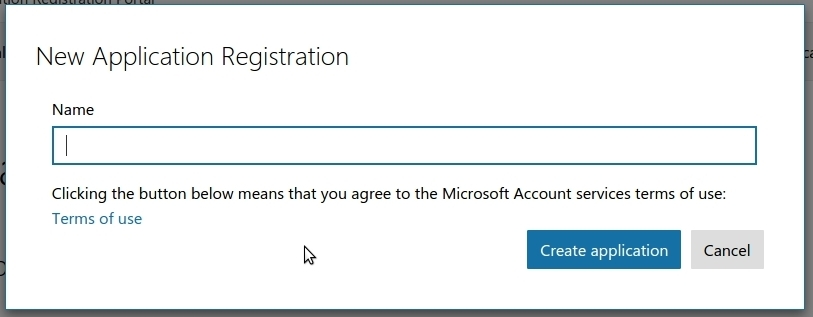
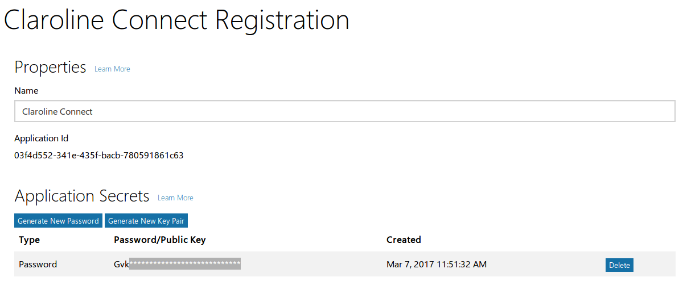
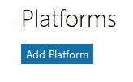
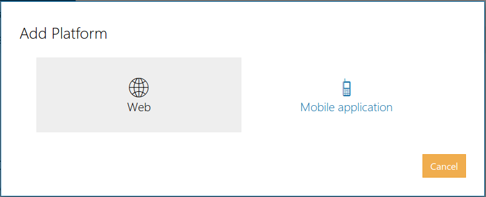

### Enregistrer et configurer une App Windows Live
---

1. Connectez-vous au [Microsoft account Developer Center](https://apps.dev.microsoft.com/#/appList) à l'aide de vos identifiants Windows et cliquez sur **Add an app**.

Donnez un nom à votre application et cliquez sur **Create application**.

2. Votre application est créée et vous êtes redirigé vers la page de configuration de votre app.

Vous y trouvez votre **Application ID** et votre **Private Key**. Il vous suffira de les copier-coller dans votre plateforme : **Administration -> Paramètres de la plateforme -> Oauth -> Windows Live**.

Cliquez sur **Add Pplatform** dans la section **Platforms**.

Choisissez **Web**.

Remplissez l'URL de redirection au format :
    
    http://VOTRE_NOM_DE_DOMAINE/login/check-windows

    Exemple: http://3l.claroline.com/login/check-windows

Remplissez éventuellement les informations dans la section **Profile** et cliquez sur **Save**.
