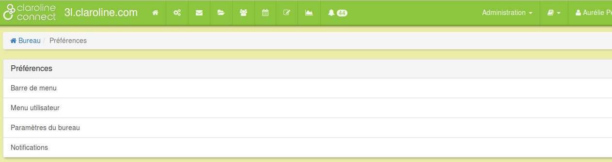
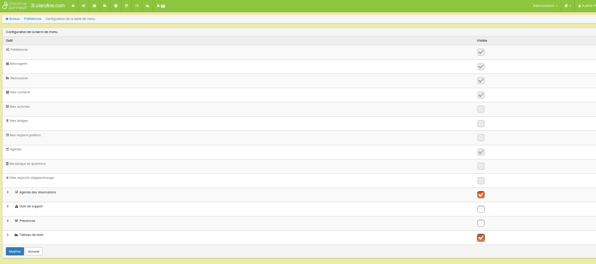
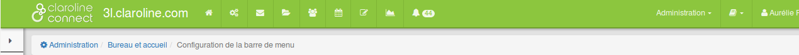
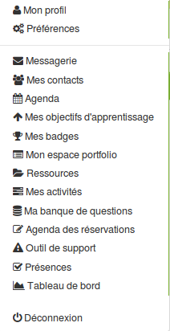
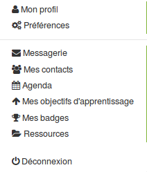
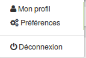
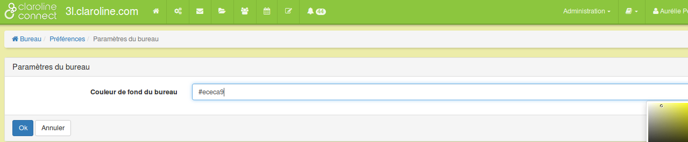
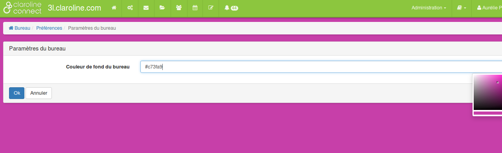

## Personnaliser votre bureau

---

Vous pouvez personnaliser votre espace à l'aide de l'outil **Préférences** 

Figure 10 - L'outil "Préférences" permet de configurer la "barre de menu" supérieure, le "menu utilisateur" et les paramètres du bureau.

Configuration de la barre de menu du bandeau supérieur.

Vous pouvez **modifier votre menu supérieur** en configurant la barre de menu. Ajoutez ou retirez des icônes du menu du bandeau supérieur en cochant ou en décochant les cases des outils.

Figure 11 - Liste des outils de la barre de menu du bureau. Il est possible de les rendre visibles en fonction des besoins de l'utilisateur.

**Comparez les deux menus**.
1) Tous les outils sont visibles

2) certains outils sont visibles

Figure 12 - Outils visibles dans la barre de menu supérieure.

**Configuration du menu utilisateur (menu du profil)**

Vous pouvez modifier votre menu utilisateur (profil utilisateur). Il vous est loisible d'ajouter ou de retirer des outils en les cochant ou en les décochant de la liste proposée.

Comparez les trois exemples ci dessous.

1) Tous les outils visibles

2) Certains outils visibles

3) Les outils visibles par défaut

Figure 13 - Trois exemples du menu utilisateur.

Paramètres du bureau: modifiez la couleur de fond de votre bureau.
Il est possible de modifier la couleur de votre bureau . Cela vous permettra de l'identifier plus rapidement et de le différencier ainsi des espaces d'activités.

Pour faire cela, cliquez sur le champ "couleur de fond du bureau" et choisissez la couleur en positionnant la souris sur la couleur souhaitée comme dans l'exemple ci-dessous.

Figure 14 - Couleur de fond du bureau originale.

Figure 15 - Modification de la couleur de fond du bureau.

