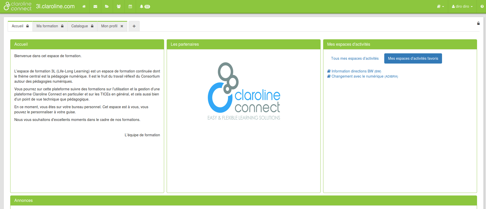
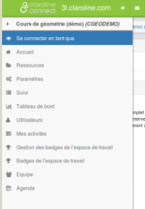

## La page d'accueil de votre espace personnel

---
Vous pouvez personnaliser votre page d'accueil à l'aide des **onglets** et des **widgets**.
Vous savez que vous êtes sur votre espace personnel grâce à:

* l'indication du **fil d'Ariane**[1] (qui indique: Mes espaces d'activités / Espace personnel / Accueil)
* la **barre de menu située à gauche**.

[1] Il s'agit d'une succession de liens qui vous permettent de vous situer dans le niveau de profondeur d'une arborescence et de naviguer pour revenir à l'un des niveaux affichés.

Figure 16 - La page d'accueil de l'espace personnel

** La barre de menu de gauche.**

En passant la souris sur la barre de menu de gauche, vous déployez une fenêtre avec les références des outils.

Figure 17 - La barre de menu de gauche

  ** Voir en tant que**  permet d'avoir un aperçu de l'espace d'activités tel que le voit un collaborateur (étudiant) ou un gestionnaire (enseignant ou le propriétaire de l'espace). Dès lors que l'on explore son espace d'activités en tant que collaborateur ou gestionnaire, l'en-tête de la page passe en couleur orange et indique "Vous êtes connecté en tant que … du workspace …".

Pour désactiver ce mode, il suffit de cliquer sur la **croix** en haut à droite du bandeau orange.

Figure 18 - Activer et désactiver "Voir en tant que ... "

**Accueil**  permet de revenir à la page d'accueil de son espace personnel (qui est distincte de celle du bureau d'accueil, rappelons-le).

 Ressources  ouvre le répertoire de ressources personnelles uniquement. Pour accéder à toutes les ressources simultanément, on ouvrira le répertoire de ressources du bureau personnel. Dès lors, on peut **ajouter de nouvelles ressources** (fichier, répertoire, texte, raccourcis, activité, ressource web, page wiki, annonces, forum, scorm, sondage, blog, cours, évaluation, exercice, parcours, Sondage, Site web) et les **organiser** ( ajouter, couper, copier, coller, supprimer, télécharger, zoomer) (Voir: [Organiser ses ressources](/bureau/organiser_ressources.md))

 **Paramètres**  permet de paramétrer son espace personnel (Voir: 3.2. [Paramétrer son espace personnel](/bureau/parametrer_espace_perso.md)).

 **Agenda**  permet de gérer l'agenda de l'espace d'activités concerné. Il se gère comme l'agenda du bureau personnel.

 **Suivi**  affiche le nombre d'actions par jour et la liste des actions par date et par utilisateur d'un espace d'activités particulier.

 **Tableau de bord**  est un autre outil statistique qui mesure la fréquentation des ressources et activités.

 **Utilisateurs**  permet de gérer efficacement les utilisateurs d'un espace d'activités.

 **Badges**  permet d'afficher la liste des badges de l'espace, et d'ajouter un badge.

 **Mes badges**  permet d'afficher les badges qu'on a obtenus dans l'espace.

 **Mes activités**  affiche les parcours et exercices effectués ou à effectuer.
 
 **Equipe**  permet de créer des équipes au sein de l'espace d'activités (Voir [créer et gérer des équipes](../outils/creer_equipes.md)).
