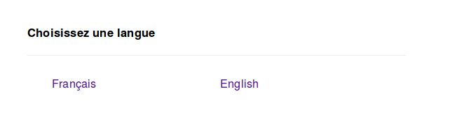
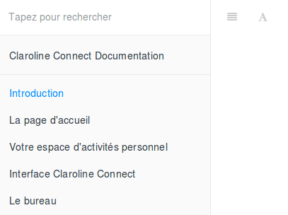
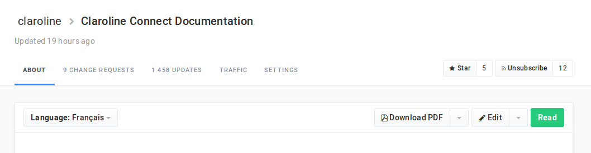
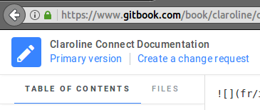
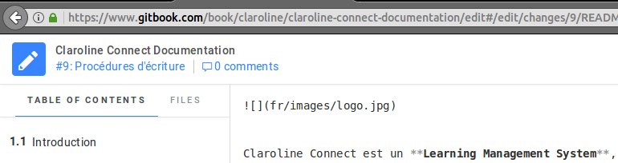

## Procédures à suivre

---

La documentation est disponible à l'adresse http://doc.claroline.com

À l'ouverture de la page, on vous demande de choisir votre langue. Cliquez sur **Français**.

Cliquez sur **Claroline Connect Documentation** dans le panneau de gauche.

Cliquez sur le bouton **Edit**.

Avant de commencer votre travail, vous devez créer votre propre branche en cliquant sur **Create a change request**. en haut à gauche de la page.

Donnez un nom significatif à votre branche. Dans l'exemple ci-dessous, l'auteur écrit le chapitre sur les procédures d'écriture de la présente documentation. Vous pouvez ajouter une description pour rendre les choses plus claires si nécessaire.

Le nom de votre brache apparaît dès lors en haut à gauche de la page.

Quand vous avez terminé votre travail, cliquez sur **Publish** à l'extrémité droite de la barre supérieure. Vous pouvez aussi le faire dès que vous avez passé un long moment sur votre page par mesure de sécurité.

N'oubliez pas de toujours travailler sur votre branche quand vous revenez sur GitBook.