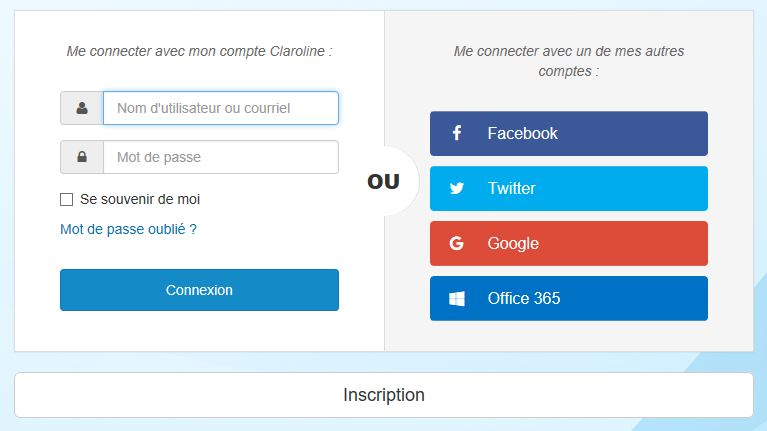

# Connexion à une plateforme

---

Pour vous connecter à une plateforme, cliquez sur **Connexion** en haut à droite de la page d'accueil.

Dans la plupart des plateformes Claroline Connect, le bouton connexion est visible en haut à droite de la page d'accueil. Dans certains cas, il est également possible d'accéder aux espaces d'activités publics à partir de la même page.

Utilisez l'identifiant et le mot de passe fournis par l'administrateur et cliquez sur "Connexion". Si l'administrateur de la plateforme l'a prévu dans sa configuration, il est également possible de se connecter via un compte de réseau social.

