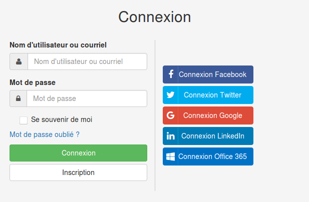

## Se connecter à une plateforme

---

Pour vous connecter à une plateforme, cliquez sur **Connexion** en haut à droite de la page d'accueil.

Home Fig. 15 - Connexion à Claroline Connect.

Dans la plupart des plateformes Claroline Connect, le bouton **Connexion** est visible en haut à droite de la page d'accueil. Dans certains cas, il est également possible d'accéder aux espaces d'activités publics à partir de la même page.

Utilisez l'identifiant et le mot de passe que vous avez choisis ou qui vous on été fournis par l'administrateur et cliquez sur "Connexion".

Home Fig. 16 - Connexion via vos identifiants Claroline Connect.

Si la plateforme a été configurée pour le permettre, vous pouvez vous connecter via un compte de réseau social.

Home Fig. 17 - Connexion via les réseaux sociaux.

