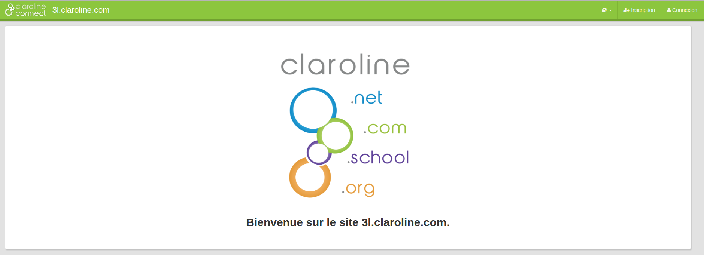
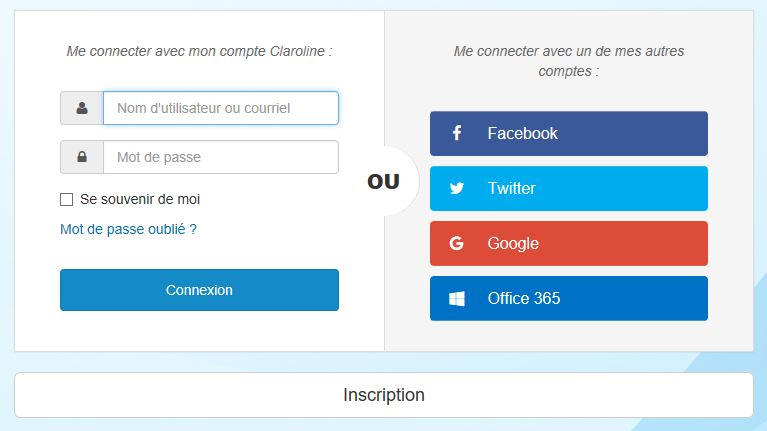

# Connexion à une plateforme

---

Pour vous connecter à une plateforme, cliquez sur **Connexion** en haut à droite de la page d'accueil.

Dans la plupart des plateformes Claroline Connect, le bouton connexion est visible en haut à droite de la page d'accueil. Dans certains cas, il est également possible d'accéder aux espaces d'activités publics à partir de la même page.

Utilisez l'identifiant et le mot de passe fournis par l'administrateur et cliquez sur **Connexion**. Si vous n'avez pas encore de compte sur la plateforme et que l'administrateur l'a prévu, vous pouvez **vous inscrire** au même endroit, éventuellement via les réseaux sociaux.

