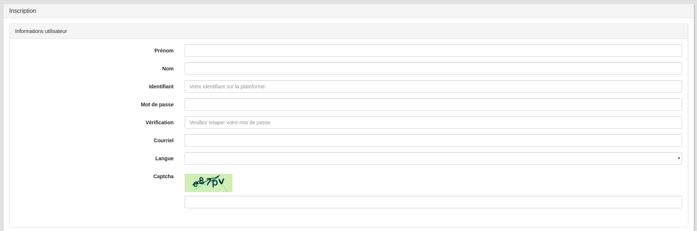

## S'inscrire à une plateforme
---

Vous accédez à votre plateforme en saisissant son adresse dans votre navigateur.

Home Fig. 13 - Exemples de sites web de quelques institutions qui utilisent la plateforme Claroline Connect

L'**accès** est **sécurisé**. C'est l'administrateur de la plateforme qui inscrit les utilisateurs.
Vous recevez un **courriel de confirmation** d'inscription contenant votre identifiant et votre mot de passe.
Si l'administrateur le permet, vous pouvez vous inscrire en utilisant le **menu Connexion**, puis Inscription en haut à droite de la page, et en suivant les instructions du formulaire.

Home Fig. 14 - Boîte de dialogue pour s'inscrire à une plateforme Claroline Connect

