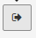

#### Configurations avancées

---

La plupart des comportements du formulaire sont définis par défaut. Vous pouvez si vous le souhaitez modifier ces derniers.

Pour cela, rendez-vous dans le menu "Configuration générale".

Depuis ce menu vous pouvez supprimer toutes les fiches contenues dans la ressource. C'est particulièrement utile si vous avez copier une ressource pour réutiliser la structure mais que vous ne souhaitez pas conserver les données.

Vous avez également la possibilité d'exporter toutes les données au format "xls" pour cela, il suffit de cliquer sur ce bouton:

