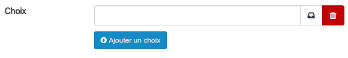
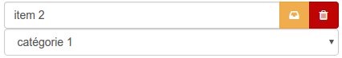
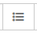
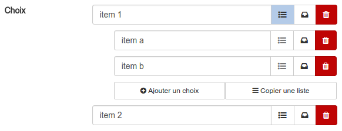
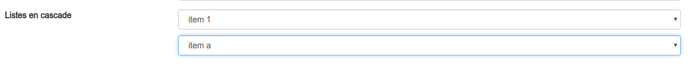
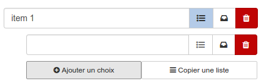
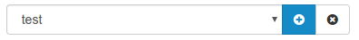

#### Créer des champs

---

Dans notre exemple, de nombreux champs sont déjà disponibles. Si vous venez de créer la ressource, ce tableau devrait être complètement vide.

En bas à gauche, vous trouverez un bouton bleu intitulé "Créer un champ". En cliquant dessus, vous ouvrez une base de données.

Vous devez d'abord attribuer un nom à votre champ.\(Sans accent et sans astrophe\)

Ensuite, vous devez choisir le type de champ. Vous constatez qu'il en existent de différents types.

* Texte: Il s'agit d'un simple cadre dans lequel peut être encodé n'importe quel type d'information.
* Nombre: Dans ce champ, ne seront acceptés que les nombres.
* Date: Ce champ permet d'afficher un calendrier dans lequel l'utilisateur peut choisir une date.
* Bouton radio: Les boutons radios sont des petits ronds à cocher. Un seul choix peut être sélectionné.
* Liste déroulante: Les listes déroulantes permettent d'afficher des choix les uns en-dessous des autres.
* Checkboxes: Elles sont basées sur le même principe que les boutons radio, mais dans ce cas, plusieurs choix peuvent être sélectionnés en même temps.
* Pays: Il s'agit d'une liste déroulante pré-complétée avec les pays.
* Courriel: Un champ texte qui n'accepte que des contenus structurés en adresse courriel. Exemple : monadresse@quelquechose.be
* Texte riche: Il s'agit d'un champ texte dans lequel vous avez [l'éditeur complet de la plateforme](/fr/resources/clacoForm/text-editor.md).

Il vous reste encore 2 petites choses à régler:

L'attribut "obligatoire" obligera le collaborateur à remplir le champ.

L'attribut "données confidentielles" permettra \(par défaut\) de ne rendre la réponse de ce champ visible que par les gestionnaires de la ressource.

##### Cas particuliers : les listes, les boutons radios et les checkboxes

Quand vous choisissez ce type de champ, vous devez encore encoder les choix qui seront proposés à vos utilisateurs.

Vous pouvez évidement ajouter autant de choix que vous le voulez.

Il vous est également possible d'associer une catégorie à un choix. Cela aura pour effet, lors de la sélection du choix, d'automatiquement attribuer [la catégorie](/fr/resources/clacoForm/form-category.md). associée à la fiche.

Si vous souhaitez associer un choix à [une catégorie](/fr/resources/clacoForm/form-category.md), il vous suffit de cliquer sur le dessin représentant un petit casier à côté de la corbeille. Une liste vous propose alors de sélectionner [la catégorie](/fr/resources/clacoForm/form-category.md) souhaitée. Pour cela, il faut avoir préalablement créé vos [catégories](/fr/resources/clacoForm/form-category.md).

Pour supprimer l'association, il suffit de cliquer sur les 3 traits blancs sur fond orange.

Vous aurez probablement remarqué que sur les listes déroulante, un autre bouton est présent sur les choix encodés.

Ce bouton vous permet d'ajouter une sous listes pour le choix. Concrètement, si vous ajouté une sous liste à votre premier item. Si un utilisateur sélectionne le premier item, il devra ensuite choisir un élément de la sous-liste. C'est ce qu'on appelle des listes en cascade. Il vous est possible de travailler sur 3 niveaux.

Voici un exemple côté "gestion des champs":

et le résultat côté "formulaire":

Pour construire ces listes, après avoir cliqué sur le bouton représentant les 3 petites lignes, vous pourrez:

Soit ajouter un choix, de la même manière que dans la liste parente

Soit **copier** les choix d'**une** autre **liste**.

Une fois les choix copiés, vous pouvez les éditer, supprimer ou associer des catégories comme pour les autres. 

> Attention, il s'agit bien de copier les choix d'une autre liste. Cela veut dire que si vous modifier la liste d'origine après la copie, les changements ne seront pas répercuté dans la sous-liste.

