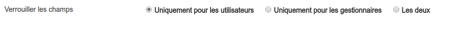

##### Champs verouillés

---

Depuis ce menu, vous pouvez définir à qui s'applique le verrouillage des champs.

Si vous selectionnez "les deux" seul un utilisateur ayant les droits d'administration sur la ressource pour éditer les champs en question. 

