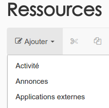
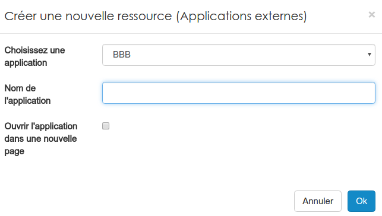
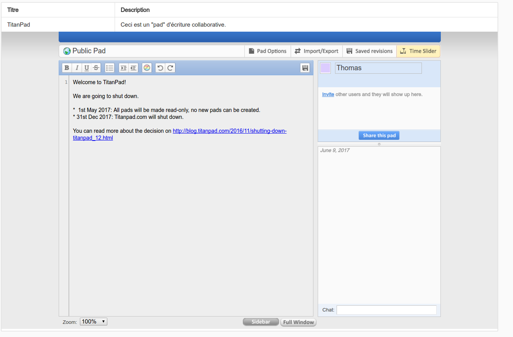

### Les applications externes (LTI)
---
Les applications externes peuvent être diverses et variées. Il serait donc très compliqué d'en faire une liste. Néanmoins, sachez que c'est l'administrateur de votre plateforme qui peut créer les ponts entre Claroline et ces applications. 

Pour voir les applications disponibles et en ajouter une à votre espace d'activités. Il suffit de dérouler le menu "ajouter".

Il faut cliquer sur "Applications externes" pour choisir celle qu'on veut utiliser.

Vous n'avez plus qu'à choisir l'application souhaitée dans la liste proposée et de lui donner le nom que vous souhaitez afficher dans vos ressources. Par la suite, si vous cliquez sur l'icône dans vos ressources, vous obtenez un affichage de ce type:

> L'exemple ci-dessus a été fait en intégrant ["TitantPad"](https://titanpad.com/).

