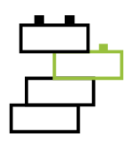
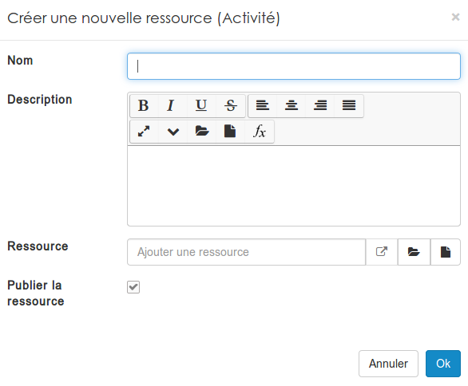

### Les activités
---

Les activités sont les éléments qui composent vos parcours pédagogiques. Si on voulait faire un parallèle maladroit et visualiser votre parcours pédagogique comme une présentation, les activités correspondraient aux _slides_. Evidemment à la différence d'un _slide_, les activités peuvent être interactives. 

Ces activités sont automatiquement générées lorsque vous développez des [parcours pédagogiques](manage-path.md).

> C'est pour cela que nous vous conseillons de toujours créer vos parcours pédagogique dans un [sous-répertoire](manage-folder.md) dédié.

Néanmoins, vous pouvez en créer manuellement afin de les utiliser dans vos prochains [parcours](manage-path.md).

Après avoir cliqué sur le "activité" dans le menu "ajouter", vous serez amené à compléter ce formulaire

