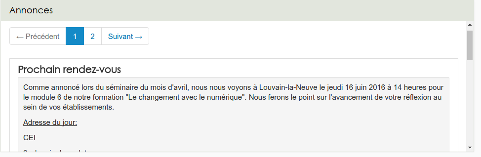

### Les annonces
---

Les ressources annonces sont d'excellents outils pour faire circuler rapidement et facilement de l'information, et particulièrement en association avec le widget du même nom.

Il est important d'avoir à l'esprit qu'une ressource annonce n'est pas un message mais un contenant. On pourrait comparer cette ressource à un panneau d'affichage sur lequel vous venez accrocher des messages. 

**Il n'est donc pas nécessaire de créer une ressource annonce pour chaque message**

Cela n'a de sens d'en créer plusieurs que si vous voulez organiser vos messages, par exemple, de manière thématique.

Pour créer cette ressource, il faut passer par le menu "ajouter" du gestionnaire de ressources. Ensuite, il suffit de donner un nom à votre "panneau d'affichage".

