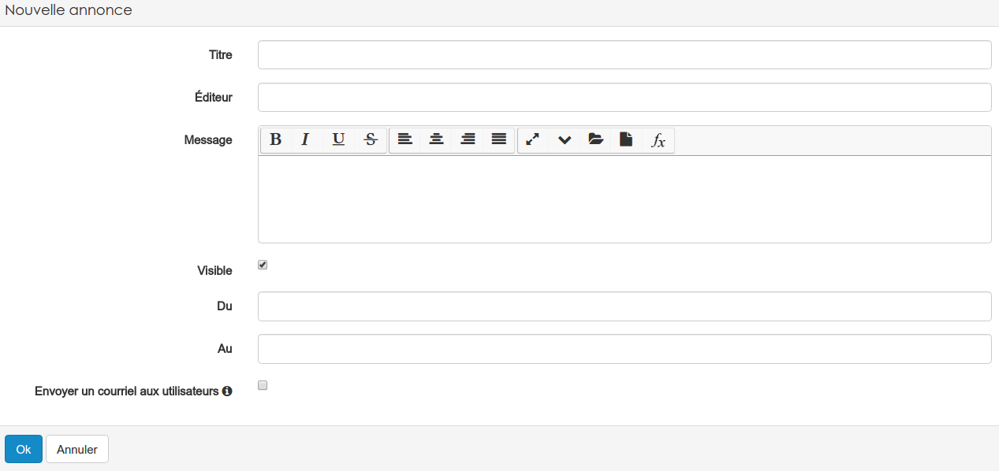
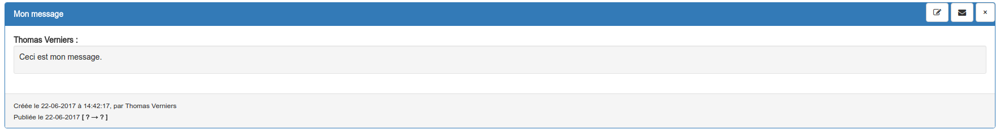

### Les annonces
---

Les ressources annonces sont d'excellents outils pour faire circuler rapidement et facilement de l'information, et particulièrement en association avec le widget du même nom.

Il est important d'avoir à l'esprit qu'une ressource annonce n'est pas un message mais un contenant. On pourrait comparer cette ressource à un panneau d'affichage sur lequel vous venez accrocher des messages. 

**Il n'est donc pas nécessaire de créer une ressource annonce pour chaque message**

Cela n'a de sens d'en créer plusieurs que si vous voulez organiser vos messages, par exemple, de manière thématique.

Pour créer cette ressource, il faut passer par le menu "ajouter" du gestionnaire de ressources. Ensuite, il suffit de donner un nom à votre "panneau d'affichage".

Il vous reste, aussi souvent que nécessaire, à créer un message.

Pour cela, cliquez sur "ajouter une annonce" et complétez le formulaire proposé.

Le **titre**, l**'éditeur** du message et le **message** en lui-même ne devrait pas poser trop de problèmes. 

En ce qui concerne les autres éléments du formulaire, quelques précisions sont peut-être nécessaire.

La case à cocher **visible** permet de définir si le message est visible par les collaborateurs de votre espace d'activités.

Vous pouvez également définir à partir de quand (**du**) et jusqu'à (**au**) le message est visible.

Enfin, il est possible d'envoyer le message sous forme de courriel interne à la plateforme à tous les membres de l'espace d'activités. 

> Cette dernière option de notification est désactivée si vous définissez des dates.

Ils vous est évidemment possible par la suite de supprimer, d'éditer ou même d'envoyer rapidement vos messages

