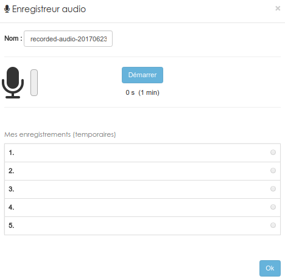
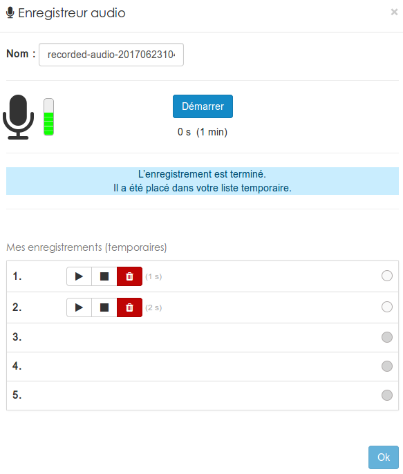
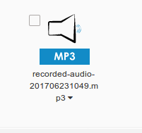

### L'enregistreur audio
---

Cette ressource permet d'enregistrer un fichier .mp3 directement dans la plateforme à l'aide du micro de votre ordinateur ou de votre smartphone.

La ressource est assez simple à utiliser, dès que vous aurez cliqué sur son nom dans le menu "**ajouter**" vous arriverez sur cette interface:

Le bouton "**démarrer**" lancera votre enregistrement. Vous devriez alors avoir un message vous demandant d'autoriser l'accès à votre micro. Inutile de vous préciser que si vous refusez cette demande, la ressource ne vous sera d'aucune utilité.

Vous pouvez faire jusqu'à 5 tentatives d'enregistrements.

Libre à vous de d'écouter et éventuellement de supprimer vos essais. Une fois que l'un d'eux vous convient, il suffit de le sélectionner en cliquant dans le rond à l'extrémité de la ligne. Après avoir valider avec le bouton "**ok**" votre fichier sera sauvegardé et apparaitra sous la forme d'un fichier .mp3 dans vos ressources. 

