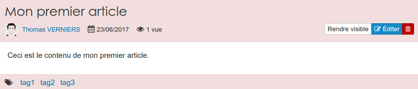

### Les blogs
---

>_"Un blog, anglicisme pouvant être francisé en blogue et parfois appelé cybercarnet ou bloc-notes, est un type de site web – ou une partie d'un site web – utilisé pour la publication périodique et régulière d'articles personnels, généralement succincts, rendant compte d'une actualité autour d'un sujet donné ou d'une profession. À la manière d'un journal intime, ces articles ou « billets » sont typiquement datés, signés et se succèdent dans un ordre antéchronologique, c'est-à-dire du plus récent au plus ancien."_
<cite>[Wikipédia]</cite>

Une fois que vous aurez cliquez sur le "**blog**" dans le menu "**ajouter**" de votre gestionnaire de ressources, il faudra lui donner un nom.

Après validation, il vous suffit de cliquer sur l'icône de votre "blog" pour le personnaliser.

Vous pouvez, si vous le souhaitez, personnaliser l'en-tête de votre blog en cliquant sur le bouton "**modifier la bannière**"

En cliquant sur le bouton "**option**", vous pouvez modifier les différents réglages de votre blog. La première partie de menu se consacre aux comportements de votre blog.

La seconde partie vous permet de gérer le nombre d'articles affichés par page  et la manière dont les tags sont affichés.

Enfin, la dernière partie du menu vous permet de déterminer les widgets qui seront affichés sur votre blog.

* **Rechercher**: Affiche un champ qui permet d'effectuer des recherches dans les articles.
* **Barre d'informations**: Il s'agit d'un widget texte permettant d'ajouter un encadré au contenu personnalisé.
* **Flux RSS**: Ce widget permet à vos lecteurs de s'abonner au flux de votre blog.
* **Nuage de tags**: Ce widget permet d'afficher un nuage de tags cliquables.
* **Rédacteurs**: Ce widget affiche la liste des auteurs d'articles et permet en un clique de ne visualiser que les articles d'un rédacteur en particulier.
* **Calendrier**: Permet de rapidement retrouver un article par sa date de publication.
* **Archives**: Ce widget affiche une arborescence, par année, présentant tous les anciens articles du blog. 

Maintenant que tout est à votre goût, vous pouvez passer à la rédaction.

Un clique sur le bouton "**+ nouvel article**" et votre travail d'auteur commence.

A moins que vous ayez cocher **publier automatiquement les articles** dans les options, une fois l'article écrit, il faudra encore le rendre visible. 

> Les articles non visibles sont encadrés de rouge pour une meilleure visibilité.

