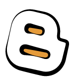

### Les blogs
---

>_"Un blog, anglicisme pouvant être francisé en blogue1 et parfois appelé cybercarnet2 ou bloc-notes, est un type de site web – ou une partie d'un site web – utilisé pour la publication périodique et régulière d'articles personnels, généralement succincts, rendant compte d'une actualité autour d'un sujet donné ou d'une profession. À la manière d'un journal intime, ces articles ou « billets » sont typiquement datés, signés et se succèdent dans un ordre antéchronologique, c'est-à-dire du plus récent au plus ancien_."<cite>[Wikipédia]</cite>

Une fois que vous aurez cliquez sur le "blog" dans le menu "ajouter" de votre gestionnaire de ressources, il faudra lui donner un nom.

