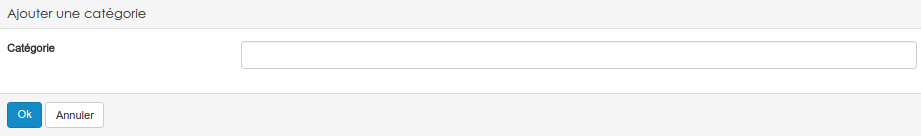
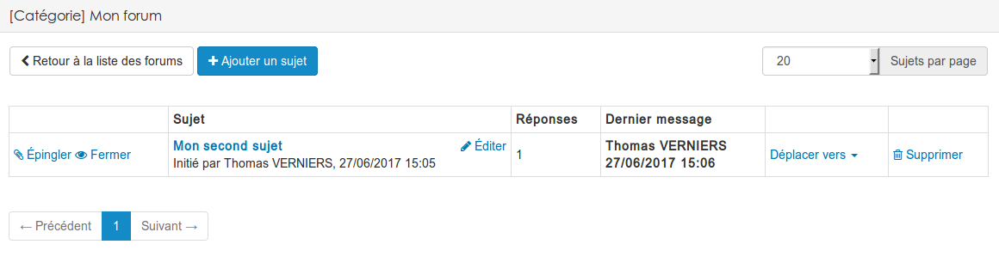

### Les forums
---

>_"En informatique, un forum est un espace de discussion publique (ou au moins ouvert à plusieurs participants). Les discussions y sont archivées ce qui permet une communication asynchrone (c'est ce qui différencie les forums de la messagerie instantanée). Il y a deux sortes de forum, en fonction du classement des messages : soit les « forums de discussion » dont les messages sont classés par date chronologique, soit les « forums de questions / réponses » dont les messages sont classés par votes. Forum est un terme d'origine latine (popularisé par l'anglais) désignant une place de la ville consacrée à la discussion et au commerce."_
<cite>[Wikipédia]</cite>

Pour ajouter un forum dans claroline, rendez-vous dans le menu "ajouter" d'un gestionnaire de ressources.

Une fois cela fait, il faudra nommer le forum que vous souhaitez mettre en place.

Il vous est également demandé si vous souhaitez activer les notifications globales du forum. L'activation des notifications globales entraîne l'envoi d'un courriel aux utilisateurs ayant accès au forum lors de l'ajout d'un message. 

Après validation, vous pourrez rentre dans votre forum qui aura été ajouté dans vos ressources. A l'ouverture vous arriverez sur la page suivante.

Dans le forum, tous les sujets (messages) s'organisent dans des catégories. Par défaut, une première catégorie a été créée et porte le même nom que le forum lui-même. 

Libre à vous de renommer cette première catégorie, de la supprimer et/ou d'en créer de nouvelles. Pour modifier le nom d'une catégorie, il suffit de cliquer sur le bouton éditer situé juste à côté. 

Pour créer une nouvelle catégorie, il vous suffit de cliquer sur le bouton adéquat dans le petit menu situé au dessus du tableau des catégories.

---
---

