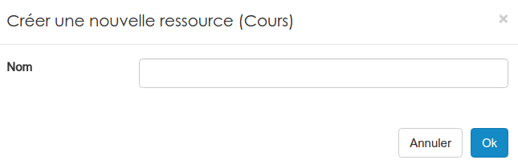
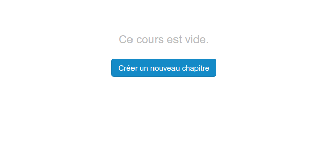
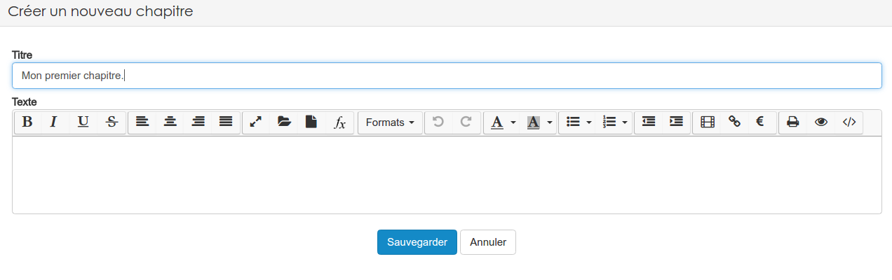
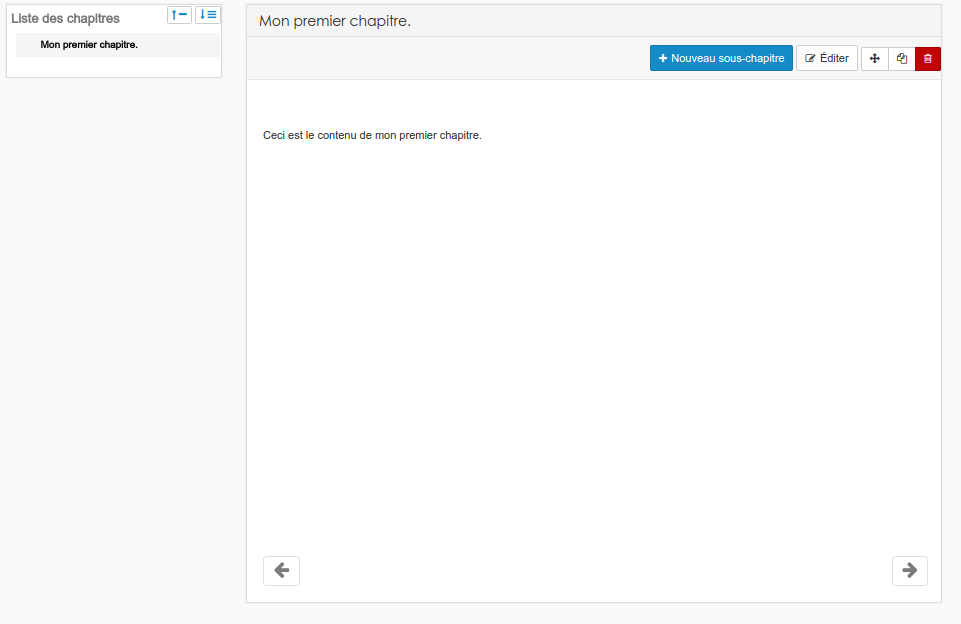
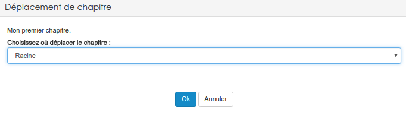
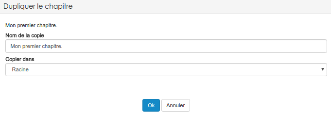

### Les cours
---

La ressource "cours"" vous permet de développer vos propres syllabus numériques. 

Comme d'habitude, après avoir cliqué sur la ressource dans le menu "**ajouter**", il faudra lui attribuer un nom.

Quand vous cliquerez, pour la première fois, sur l'icône de votre cours, vous arriverez sur une page vous proposant de créer votre premier chapitre.

Créer un nouveau chapitre, est assez simple, il suffit de lui attribuer un **titre** et le plus important, son **contenu (texte)**. Vous avez accès à [l'éditeur riche](../interface/text-editor.md) de la plateforme. Cela veut dire que vous pouvez intégrer dans votre cours, en plus du texte, des liens, des images et même des vidéos.

Une fois le premier chapitre écrit, vous aurez un aperçu de votre cours. 

Comme vous avez pu le constater, le cours se divise en deux parties distinctes: La **liste des chapitres** et sous-chapitres à gauche et le contenu du chapitre sélectionné à droite. 

Si vous avez les droits d'édition sur la ressource, vous avez accès depuis cette seconde partie à une série d'action.

Vous pouvez créer un **nouveau sous-chapitre**, **éditer** la page qui est affiché ou encore supprimer cette page via le bouton "**poubelle**".

Le bouton avec la **croix fléchée** vous permet de changer la position occupée par la page affichée dans la structure de votre cours.

Le bouton avec la **pile de feuilles** permet tout simplement de dupliquer la page affichée. 

