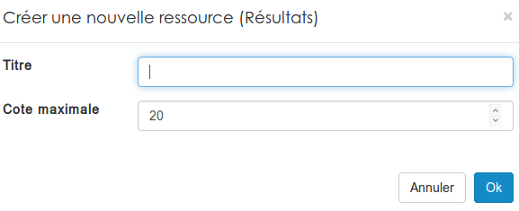
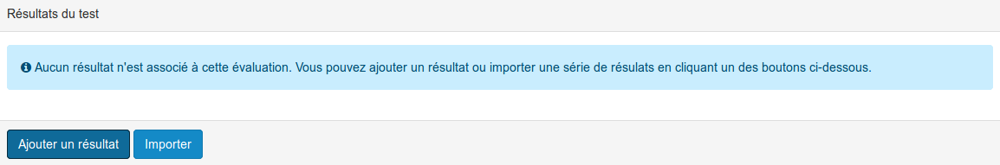
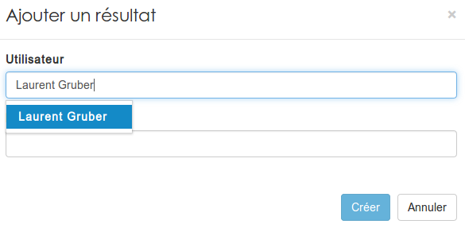
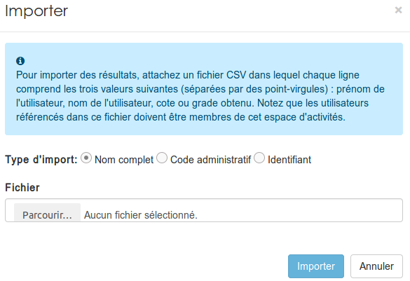
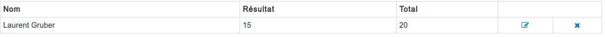

### Les résultats
---

Pour créer un nouveau résultat, il faut passer par le menu "ajouter" d'un gestionnaire de ressources.

Vous devez définir le nom de votre résultat, et la note maximale attribuable.Une fois que c'est fait, votre résultat sera disponible dans les ressources. Il vous faudra ensuite entrer dans la ressource pour attribuer les notres à vos apprenants.

Vous pouvez soit ajouter les résultats utilisateur par utilisateur:

> Vous ne pouvez attribuer une note uniquement aux utilisateurs inscrits dans l'espace d'activités.

Soit importer un fichier qui contient tous les résultats:

Les résultats apparaissent alors sous forme de tableau depuis lequel vous pouvez modifier ou supprimer les résultats déjà encodés:

> Les collaborateurs ne peuvent visualiser que les résultats associés à leur nom. 