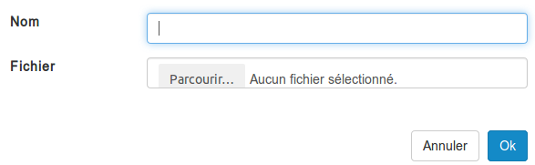
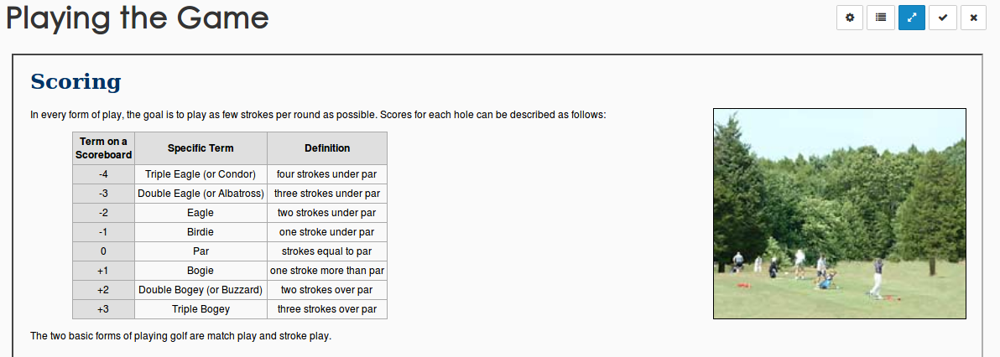
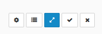
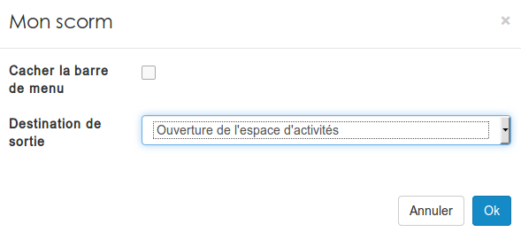
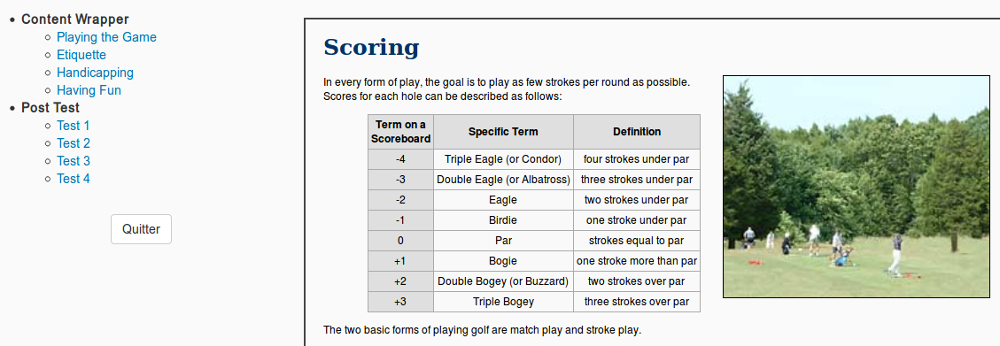
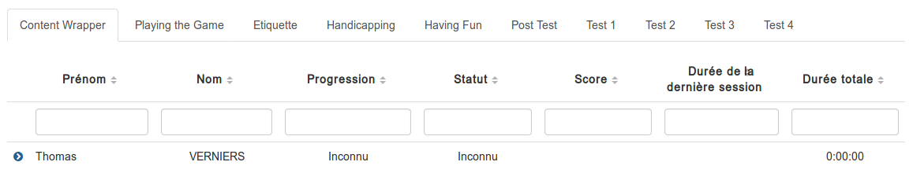

### Les scorms 
---

Pour déposer un Scorm, que ce soit 1.2 ou 2004, il faut passer par le menu "ajouter" d'un gestionnaire de ressources.

Vous devez choisir un nom pour votre ressource Scorm et ensuite sélectionner l'archive sur votre ordinateur en cliquant sur "parcourir". Après avoir cliqué sur "ok", votre Scorm sera disponible dans vos ressources.

