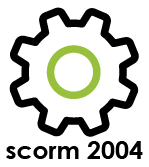

### Les scorms 
---

Pour déposer un Scorm, que ce soit 1.2 ou 2004, il faut passer par le menu "ajouter" d'un gestionnaire de ressources.

Vous devez choisir un nom pour votre ressource Scorm et ensuite sélectionner l'archive sur votre ordinateur en cliquant sur "parcourir". Après avoir cliqué sur "ok", votre Scorm sera disponible dans vos ressources.

L'affichage exact que vous aurez en ouvrant votre Scorm dépendra très fort de celui-ci. Vous aurez néanmoins en commun une série de bouton d'action réuni dans un menu.

* **Le rouage** vous permet de modifier certains régalges de votre Scorm:

* **La liste** vous permet d'ouvrir ou de fermer le sommaire de votre Scorm: 

* **La double flèche** vous permet d'afficher le Scorm en plein écran.
* **Le petit "v"** permet d'afficher le suivi du Scorm:

> Les informations disponibles vont varier selon la version de votre Scorm (1.2,2004) et ça strutcture. Certains Scorms ne remontant pas de données vers la plateforme. 

* **La croix** vous permet de fermer le Scorm. 

