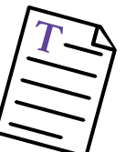

### Les texte
---

La ressource texte est la principale ressource de contenu. Grâce à l'éditeur riche, elle vous permet de mettre rapidement en page du texte mais aussi des images, des vidéos ou encore des liens.

Pour plus de précisions, rendez-vous dans la section consacrée à l'[éditeur riche](../interface/text-editor.md).