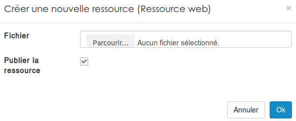
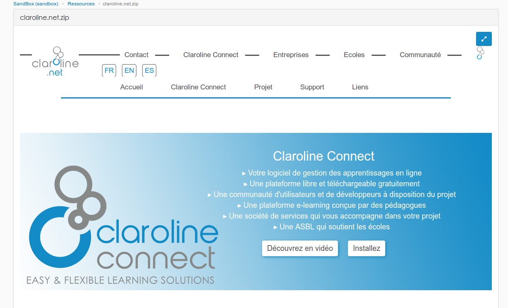

### Les ressources web 
---

La ressource web vous donne la possibilité d'importer une archive .zip pouvant contenir du html, du css ou encore du javascript afin d'héberger et d'afficher ce contenu web dans la plateforme. 

Pour importer une nouvelle ressource web, il faut passer par le menu "ajouter" d'un gestionnaire de ressources.

Le nom de l'archive que vous selectionnez sera automatiquement utilisé comme nom pour la ressource.

Et voici un exemple avec le site claroline.net:

La double flèche permet à l'utilisateur d'afficher la ressource en plein écran.

> Il est important qu'un index.html soit présent à la racine de votre archive pour que cela fonctionne. 

>Lorsque sur votre ordinateur vous faites un clic droit sur un dossier pour le compresser, il se peut que la structure nécessaire à l'importation de la ressource web ne soit plus respectée. Il est donc conseillé d'ouvrir le dossier contenant tous vos fichiers, de les sectionner tous et puis de faire clic droit -> compresser. 