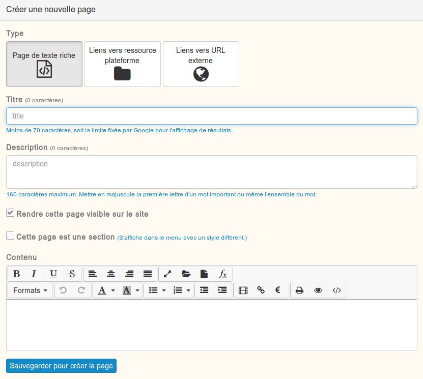

### Les sites web
---

Pour créer un nouveau site web, il faut utiliser le menu "ajouter" depuis un gestionnaire de ressources.

A la création, il vous sera demandé de définir un nom. Ce nom ne sera affiché que dans le gestionnaire de ressources. Il n'apparaitra pas sur le site en lui-même.

A l'ouverture de la ressource, avec les droits d'édition, vous serez confronté à l'affichage suivant.

Si la ressource peut sembler dérouante et compliquée au début, elle est en réalité assez simple à utiliser.

Vous devez créer une première page, qui par défaut, sera la page d'accueil de votre site.

Comme vous pouvez le constater sur l'illustration, vos pages peuvent:

* Soit être complétées à l'aide de [l'éditeur riche](../interface/text-editor.md).
* Soit afficher une ressource de la plateforme, attention alors à la gestion des droits.
* Soit afficher une page externe à la plateforme. Cette dernière solution amenera vos utilisateurs à quitter votre site et la plateforme.

Vous pouvez créer autant de pages que vous le souhaitez, votre menu de navigation se complétera automatiquement avec les titres de vos pages.

Depuis la liste de vos pages, vous pouvez facilement organiser l'ordre d'affichage de votre menu.

Si vous souhaitez changer de page d'accueil (celle qui est affichée lors de l'ouverture de la ressource), il vous suffit d'afficher la page que vous souhaitez utiliser et de cliquer sur le bouton suivant:

Pour avoir un aperçu du résultat, il vous suffit de cliquer sur le bouton "visualiser" en haut à droite de votre page.

Une fois tous le contenu ajouté à votre site, vous souhaitez probablement en personnaliser l'aspect.

Vous trouverez toutes les fonctions nécessaires pour cela dans le menu principal.

Dans chaque menu vous aurez une prévisualisation de vos modifications. Par contre, pour que vos changements soient pris en compte, il faudra **sauvegarder vos modifications**.

###### Général

Depuis ce premier menu, vous pouvez définir le comportement général de votre site web à travers plusieurs paramètres:

* **La largeur de votre site**
* **Les couleurs de fond ou **
* **Un lien vers un outil externe de statistiques**
* **Une CSS** à appliquer sur toutes les pages pour ceux qui s'y connaissent.

###### Menu

Cette partie est dédié à la personnalisation de l'affichage du menu.

###### Menu

Cette partie est dédié à la personnalisation de l'affichage du menu.

###### Bannière / Pied de page

Ces deux dernières parties vous permettront de personnaliser l'en-tête et le bas de page de votre site. Les paramètres modifiables sont les mêmes dans les deu cas.

Voici un exemple de site terminé:

