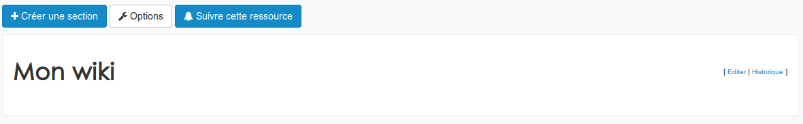

### Les wikis
---

>_"Un wiki est une application web qui permet la création, la modification et l'illustration collaboratives de pages à l'intérieur d'un site web. Il utilise un langage de balisage et son contenu est modifiable au moyen d’un navigateur web. C'est un outil de gestion de contenu, dont la structure implicite est minimale, tandis que la structure explicite émerge en fonction des besoins des usagers."_
[Wikipédia]

Pour créer un nouveau wiki, il faut passer par le menu "ajouter" d'un gestionnaire de ressources.

Après avoir donné un nom à vôtre wiki, il suffit de cliquer sur "ok" pour l'ajouter à vos ressources.

A la première ouverture, votre wiki est complétement vide.

Il faudra donc créer une première section en cliquant sur le bouton en haut à gauche.

Il suffit d'un titre et d'éventuellement d'un peu de contenu pour créer une première section.

Après la création de votre première section, vous aurez un aperçu de votre wiki, qui n'est pas encore très étoffé. A partir de ce moment, vous pouvez créer de nouvelles sections ou sous-sections pour enrichir votre wiki.

Si nécessaire, vous pouvez facilement ré-organiser vos section depuis le sommaire. Il faut pour cela, au préalable, cliquer sur le bouton en forme de croix pour activer le mode "édition".

Au sein de chaque section, vous retrouverez le même menu.

* **Ajouter une section ici** permet de créer directement une sous-section dans la section où vous vous trouvez.
* **Editer** permet de modifier, de supprimer ou de déplacer une section.

* **Historique** permet de consulter tous les changements qui ont été apportés à la section.

Cliquez sur la date de la modification pour pouvoir la consulter.

* **Rendre invisible** permet de retirer la section du mode lecture sans la supprimer.
* **La flèche** permet simplement de remonter au sommet de la page.

Depuis le menu général, en haut de la page, il est possible de modifier certains paramètre de votre wiki.

C'est également depuis ce menu que vous pouvez restaurer ou supprimer définitivement une section qui a été supprimer depuis le mode "édition"/

