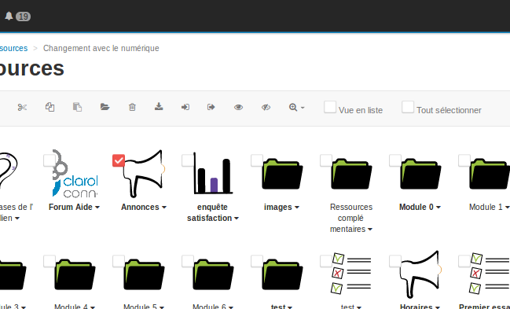
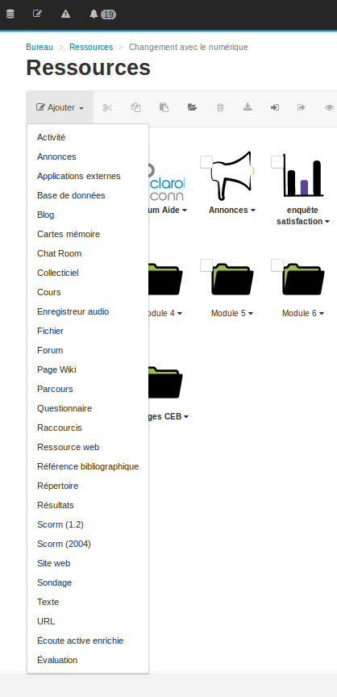
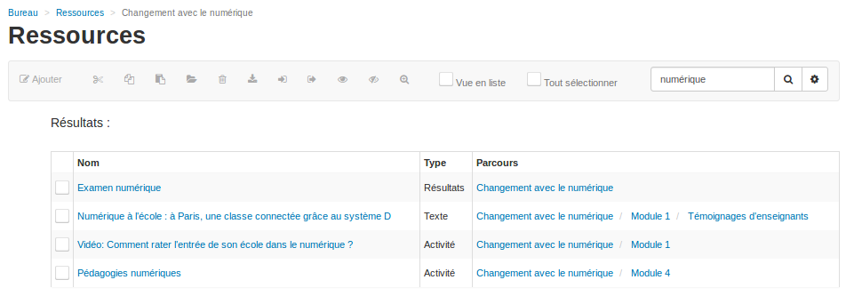

## La barre de propriétés
---

La barre de propriétés du gestionnaire de ressources permet:

* de **gérer** les ressources d'un espace d'activités. En sélectionnant la ou les ressources affichée(s), on peut la/les **couper - coller - supprimer - télécharger - zoomer - administrer**

    

Figure 122 - La barre de propriétés du gestionnaire de ressources

* d'**ajouter** de nombreuses ressources ou d'en **importer** d'autres

à partir d'autres espaces d'activités.
    

   

Figure 123 - Créer ou importer des ressources

  
* de **rechercher** une ressource à l'aide du moteur de recherche ou de **définir automatiquement des dates de publication** pour une ressource (roue crantée) :

Figure 124 - Rechercher une ressource ou définir des dates de publication pour une ressource

